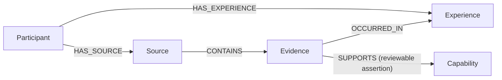

# OSI/PIA Graph Ontology Crosswalk

**Status:** Working architecture

**Scope:** Current participant evidence graph, OSI reference projection, and
shared congruence profile

**Database projection:** Neo4j

## Purpose

This document connects the conceptual ontology to the implemented graph
without allowing the graph to redefine the ontology.

It answers:

- which reference database owns a projection;
- which concepts have a current graph projection;
- which identifiers and relationships are contracted;
- which graph objects are operational or experimental rather than domain
  ontology;
- which broader OSI concepts remain planned;
- where authoritative definitions and executable behavior live.

## Authority order

When documents differ, interpret them by responsibility rather than by file
age:

1. [`ontology/`](../../ontology/README.md) defines conceptual meaning.
2. The
   [`Ontology Registry`](../../governance/registries/ONTOLOGY_REGISTRY.md)
   records stable namespaced identity and status.
3. [`Graph_Architecture.md`](Graph_Architecture.md) and the
   database-specific specifications define projection boundaries.
4. [`OSI_PIA_Data_Graph_Contract_v0.1.md`](../../docs/contracts/OSI_PIA_Data_Graph_Contract_v0.1.md)
   defines the current participant data-to-graph contract.
5. [`OSI_PIA_Import_Contract_v0.1.md`](../../docs/contracts/OSI_PIA_Import_Contract_v0.1.md)
   defines import behavior.
6. [`graph/schema/`](../../graph/schema/README.md) and versioned migrations
   define executable database mechanics.
7. This crosswalk records alignment and maturity; it does not replace any of
   those authorities.

The ontology meta-model in
[`ontology/META_ONTOLOGY.md`](../../ontology/META_ONTOLOGY.md) governs how
those mappings are described.

The shared executable conventions and compatibility corrections are defined
in the
[`OSI/PIA Reference Graph Congruence Profile`](REFERENCE_GRAPH_CONGRUENCE.md).
Database roles and current validation boundaries are defined in the
[`OSI Reference Database`](OSI_Reference_Database.md) and
[`PIA Reference Database`](PIA_Reference_Database.md) specifications.

## Current contracted participant graph

The `SUPPORTS` relationship is analytical. Its mapping identity, confidence,
basis, proposer, review status, and timestamps keep the interpretation
separate from the underlying Evidence.

## Contracted node projections

| Ontology concept | Graph label | Stable identity | Current authority | Maturity |
|---|---|---|---|---|
| Participant | `Participant` | `participant_id` | Data and Graph Contract v0.1 | Contracted; importer present |
| Source | `Source` | `source_id` | Data and Graph Contract v0.1 | Contracted; importer present |
| Experience | `Experience` | `experience_id` | Data and Graph Contract v0.1 | Contracted; importer present |
| Evidence | `Evidence` | `evidence_id` | Data and Graph Contract v0.1 | Contracted; importer present |
| Capability | `Capability` | `capability_id` | Data and Graph Contract v0.1 | Contracted; importer present |

Properties, required values, enums, and confidentiality rules remain in the
contracts rather than being duplicated here.

## Contracted relationship projections

| Start | Relationship | End | Semantic class | Interpretation |
|---|---|---|---|---|
| Participant | `HAS_SOURCE` | Source | provenance context | Source belongs to the participant package |
| Participant | `HAS_EXPERIENCE` | Experience | contextual membership | Experience is represented for the participant |
| Source | `CONTAINS` | Evidence | provenance | Evidence is grounded in the Source |
| Evidence | `OCCURRED_IN` | Experience | temporal/contextual | Evidence occurred in the Experience when known |
| Evidence | `SUPPORTS` | Capability | analytical assertion | Evidence may support a Capability subject to review |

`OCCURRED_IN` is optional when the source does not establish an Experience.
Unmapped Evidence is valid. The importer must not manufacture missing context
or capability assertions.

## Operational graph objects

`ImportRun` is an operational audit object used by the participant importer.
It records an import state transition and supports traceability, but it is not
part of the organizational domain ontology. Operational metadata such as
`last_import_run` must not be mistaken for participant or organizational
meaning.

## Working meta-ontology registries

The `osi-reference` and `pia-reference` databases have separate additive
working registries for the meta-ontology described in
[`ontology/META_ONTOLOGY.md`](../../ontology/META_ONTOLOGY.md).

| Registry object | Purpose | Maturity |
|---|---|---|
| `Ontology` | Root and scope for the OSI Reference registry | Implemented; working |
| `Concept` | Registers graph labels and holds complete declarations for the bounded core projection | Implemented; core at Congruence; remaining inventory at Formulation |
| `RelationshipDefinition` | Registers relationship direction, endpoints, semantic class, cardinality, and assertion requirements for the bounded core | Implemented; core at Congruence; remaining inventory at Formulation |
| `LifecycleState` | Represents Observation through Stewardship | Implemented; working |
| `KnowledgeState` | Represents proposed, working, canonical, deprecated, and retired status | Implemented; working |
| `ConfidenceModel` | Documents the applicable confidence vocabulary and scope | Implemented; working; validation-enforced where contracted |
| `ArchitectureProfile` | Declares shared graph conventions and ethical boundaries | Implemented; Congruence |
| `GraphMigration` | Records applied architecture migrations | Implemented; operational |

The executable change is
[`001_osi_reference_meta_ontology.cypher`](../../graph/migrations/001_osi_reference_meta_ontology.cypher)
and its verification query is
[`validate_osi_reference_meta_ontology_v0.1.cypher`](../../graph/cypher/validation/validate_osi_reference_meta_ontology_v0.1.cypher).
The PIA Reference counterpart is
[`002_pia_reference_meta_ontology.cypher`](../../graph/migrations/002_pia_reference_meta_ontology.cypher)
with
[`validate_pia_reference_meta_ontology_v0.1.cypher`](../../graph/cypher/validation/validate_pia_reference_meta_ontology_v0.1.cypher).
The v0.1 registry migrations do not relabel or rewrite domain nodes. Registry
IDs are scoped to their database, and an observed item remains `working` until
its conceptual meaning is promoted through governance.

The v0.2 congruence migrations are
[`003_osi_reference_architecture_congruence.cypher`](../../graph/migrations/003_osi_reference_architecture_congruence.cypher)
and
[`004_pia_reference_architecture_congruence.cypher`](../../graph/migrations/004_pia_reference_architecture_congruence.cypher).
They add the shared `ArchitectureProfile`, complete the bounded core
declarations, align contract properties, and correct unambiguous relationship
type drift. They do not promote working ontology items to canonical status.

## Experimental analytical extension

The PIA Assessment Stack currently introduces:

- `Assessment`;
- `IdentityHypothesis`;
- references to `Pattern`;
- `HAS_ASSESSMENT`;
- `EVALUATES`;
- `USES_CAPABILITY`;
- `BASED_ON`;
- `SUPPORTS_IDENTITY`.

These objects preserve analysis outside the evidence layer, but they are not
part of the contracted participant graph v0.1. Their current authority is
[`analysis/PIA/PIA_Assessment_Stack/README.md`](../../analysis/PIA/PIA_Assessment_Stack/README.md).
They require ontology declarations, contract integration, and assurance before
promotion into the canonical graph.

The live PIA relationship corrections are:

- `Assessment-[:USES_CAPABILITY]->Capability`; the ambiguous legacy `USES`
  type is deprecated;
- `Source-[:DESCRIBES]->Experience`; `CONTAINS` is reserved for the contracted
  `Source -> Evidence` provenance relationship.

Legacy property names remain available for compatibility while canonical
aliases such as `Evidence.evidence_text`, `Capability.capability_name`, and
`created_at` are populated.

### Behavioral capability profile

The working
[PIA Capability and Pattern Profile](../../ontology/PIA_CAPABILITY_PATTERN_PROFILE.md)
adds eight report-level Pattern nodes and a behaviorally defined Capability
vocabulary. It uses the existing `Evidence-[:SUPPORTS]->Capability` and
`Capability-[:CONTRIBUTES_TO]->Pattern` projections rather than introducing a
parallel evidence path.

Mappings created under
[`pia-capability-evidence-mapping-0.2`](../../docs/contracts/PIA_Capability_Evidence_Mapping_Profile_v0.2.md)
add evidence role, claim scope, application status, inference level, mapping
basis, negative boundary, contextual scope, and source-independence limits to
the existing assertion metadata. Educational preparation remains distinct
from demonstrated application. Generic
`Teamwork` and `Leadership` Capability targets are prohibited; those ideas
remain Pattern-level groupings composed from specific behaviors.

The extension is implemented by migration `005` and its validator. It remains
working and proposed even after installation.

## Broader OSI projection

The OSI registry now declares Organization, Person, Role, Position, Team,
OrganizationalUnit, Capability, CapabilityCapital, EffectiveCapability,
Topology, FieldCondition, Trust, Predictability, OrganizationalCapital,
OrganizationalEnergy, Flow, State, StateTransition, Event, Outcome, Vacancy,
Construct, and OrganizationalHealth as the bounded living-system projection.

Existing data uses additive specialization labels:

- `Department:OrganizationalUnit`;
- `StaffingEvent:Event`.

Trust, Predictability, Flow, OrganizationalHealth, and the other theoretical
constructs are declared but not instantiated. They remain planned until their
indicator, derivation, temporal, privacy, and validation contracts are
approved. Registry declaration makes the architecture visible; it does not
manufacture an assessment.

Before promotion, each broader concept needs:

1. a complete ontology declaration and distinction from neighboring concepts;
2. an explicit data or derivation source;
3. stable identity and temporal rules where applicable;
4. a graph mapping and migration;
5. validation and assurance evidence;
6. privacy, consent, and misuse review.

## Projection rules

- Use `PascalCase` singular node labels.
- Use `UPPER_SNAKE_CASE` relationship types with explicit direction.
- Use `snake_case` properties and one contracted stable identity per node
  type.
- Preserve Source-to-Evidence provenance through every downstream
  interpretation.
- Represent uncertainty and review state on assertions rather than rewriting
  Evidence.
- Treat unknown values as unknown; do not create inferred placeholders during
  import.
- Record graph changes through versioned migrations and validation.
- Do not claim implementation until executable schema, import behavior,
  validation, and documentation agree.

## Known convergence work

The historical `graph/schema/` directory remains a descriptive compatibility
location. Versioned migrations are the executable authority. The v0.2 schema
catalogues use the same canonical labels and relationship types as this
crosswalk, and obsolete `id`, `Metric`, `Transition`, and ambiguous `USES`
examples are no longer presented as current architecture.

Remaining convergence work is intentionally semantic rather than cosmetic:

- review provisional legacy Capability definitions;
- resolve unknown legacy collection, extraction, fidelity, and date metadata;
- classify inventory-only OSI relationship types;
- approve data and derivation contracts before instantiating field
  conditions or OrganizationalHealth.

## Maintenance

Update this crosswalk whenever an ontology item becomes contracted,
implemented, deprecated, or assured. Every update should point to the
authoritative ontology declaration, contract, migration, and validation
evidence rather than restating their full contents.
