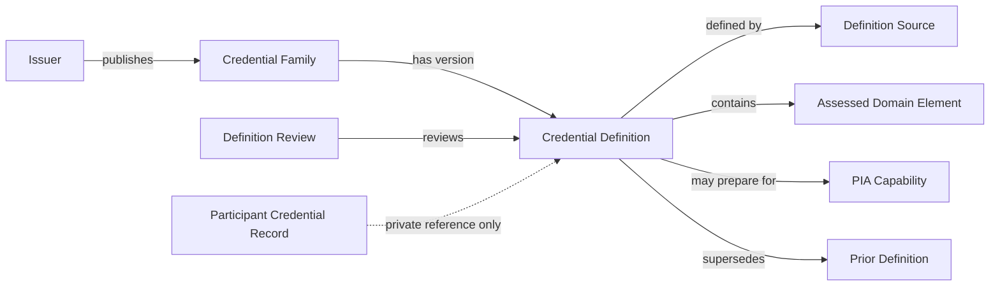

# PIA Credential Definition Library

> **Development state: IN PROGRESS — SUBJECT TO CHANGE.**
> This is working, proposed architecture at Formulation. The library model,
> identifiers, record fields, source-authority vocabulary, crosswalk
> semantics, review cycle, storage form, and graph candidates may change
> through contract, ontology, assurance, privacy, licensing, and governance
> review. The participant-free Phase 3 catalog now includes an independent
> review workbench and one review-pending public definition candidate; it is
> not an accepted credential registry.

## Purpose

This document proposes a governed, reusable library of public credential
definitions for PIA intake and analysis.

## Implemented Phase 3 increments

The first participant-free Phase 3 increment implements:

- the versioned
  [Credential Definition Catalog Contract](../../docs/contracts/PIA_Credential_Definition_Catalog_Contract_v0.2.md);
- normalized issuer, family, definition, source, domain, review, and
  expansion-queue collections;
- a standard-library catalog validator and resolver;
- exact-title, acronym, alias, issuer, version, and effective-date matching;
- explicit `resolved`, pending-review, ambiguous, version-unknown,
  source-needed, inaccessible, and conflicting outcomes;
- participant-data and private-path exclusion checks;
- title-collision, supersession, source-integrity, and review-boundary tests;
  and
- one current ASIS Physical Security Professional definition candidate based
  on issuer-primary material.

Phase 3A additionally implements:

- explicit proposal and reviewer actor identities;
- validation that prevents a proposing actor from reviewing its own record;
- package-level inspection of public definition, source, domain, and negative
  boundary records;
- accountable accept, accept-with-limits, revise, reject, and dispute paths;
- preview-first staged mutation and full validation before catalog writes;
- a localhost, preview-only-by-default review workbench;
- explicit write enablement, confirmation, single-writer locking, rollback,
  append-only review history, and installed-state revalidation; and
- an annual review cycle with documented event-driven review triggers.

The complete operational and authority boundary is defined by the
[Phase 3A Credential Review Profile](PIA_Phase_3A_Credential_Review_Profile.md).

The ASIS PSP candidate remains `source_defined/pending`. This state is
intentional. Capturing issuer material and checking its structure do not
constitute the independent definition review required for reusable
`issuer_verified` status.

Phase 3B now implements a strict participant-free lookup request,
catalog-first routing, an optional Credential Engine registry connector, an
encrypted protected-store relationship, and targeted issuer/version
clarification. It reuses accepted definitions, sends existing pending
packages and external candidates to Phase 3A, and never treats a registry
match or participant clarification as issuer verification. Its boundary is
defined by the
[Phase 3B Credential Lookup Profile](PIA_Phase_3B_Credential_Lookup_Profile.md).

Credential-to-capability crosswalks, participant application linkage, graph
projection, autonomous source acquisition, and automatic document extraction
remain outside these increments.

The library answers:

> What does a particular issuer say a particular version of a credential
> assesses or represents?

It does not answer:

> Does a participant hold the credential, where did they apply it, how well
> did they perform, or which professional identity should be assigned?

Those participant-scoped questions remain in private intake, evidence,
application-assertion, assessment, and review records governed by the
[PIA Intake Subsystem Framework](PIA_Intake_Subsystem_Framework.md).

This is a working architecture proposal under active development. It is not
yet a populated canonical registry, data contract, or graph migration.

## Why a reusable library is required

Credential titles are an unreliable substitute for credential meaning:

- the same title can cover different content across issuers;
- an issuer can revise a body of knowledge without changing the title;
- an acronym can identify unrelated credentials;
- prerequisites may materially affect what completion represents;
- short-course certificates and experience-based certifications have
  different evidentiary implications;
- a credential may be active, retired, renamed, superseded, or jurisdiction
  specific; and
- issuer material can conflict with participant-supplied or secondary
  descriptions.

Without a reusable library, every participant intake repeats the same
research, produces inconsistent mappings, and makes definition corrections
difficult to propagate.

## Authority boundary

The library is a reference source for credential meaning. It is subordinate
to:

- the [PIA Measurement Doctrine](../../governance/PIA_MEASUREMENT_DOCTRINE.md);
- the
  [PIA Behavioral Capability Inference Principle](../../principles/PIA%20Behavioral%20Capability%20Inference%20Principle.md);
- the
  [PIA Capability and Pattern Profile](../../ontology/PIA_CAPABILITY_PATTERN_PROFILE.md);
- the
  [PIA Capability Evidence Mapping Profile](../../docs/contracts/PIA_Capability_Evidence_Mapping_Profile_v0.2.md);
  and
- repository privacy, provenance, registry, namespace, and promotion
  governance.

An issuer is normally authoritative for the published scope and requirements
of its own credential. Issuer authority over a credential definition does not
make the issuer authoritative about a participant's application,
proficiency, performance, or identity.

## Library boundary

### The library may contain

- issuer identity and public issuer metadata;
- credential family, title, acronym, and known aliases;
- versioned or dated credential definitions;
- body-of-knowledge or domain summaries;
- eligibility and experience prerequisites;
- assessment format at a bounded level;
- renewal, continuing-education, and expiration rules;
- active, historical, retired, renamed, and superseded status;
- jurisdiction or geographic applicability;
- public source links and retrieval metadata;
- integrity hashes for retained public-source snapshots;
- definition conflicts and unresolved questions;
- proposed mappings to PIA capabilities;
- mapping basis and negative boundaries;
- human review and stewardship history; and
- review-cycle and event-driven refresh metadata.

### The library must not contain

- participant names or identifiers;
- credential numbers;
- participant completion dates;
- assessment scores;
- private certificates or transcripts;
- participant consent or confidentiality records;
- claims that a participant applied the credential;
- participant capability findings;
- participant feedback about personal work context;
- employment evidence; or
- report outputs.

Participant data can reference an accepted `credential_definition_id` without
becoming part of the public definition library.

## Conceptual model



### Issuer

The organization that owns, awards, or governs the credential. Issuer
identity must remain separate from source publisher when a third party hosts
or republishes issuer material.

### Credential Family

The stable conceptual identity of a credential across versions. A family may
retain aliases and historical titles without collapsing different issuers or
unrelated acronyms.

### Credential Definition

A versioned or effective-dated representation of what the credential covers,
requires, or assesses. Definitions are immutable after acceptance; a material
change creates a new definition that supersedes the prior record.

### Definition Source

A public issuer page, body-of-knowledge document, candidate handbook,
regulation, archived issuer page, or bounded secondary source used to support
the definition.

### Assessed Domain Element

A structured domain, task, knowledge area, competency, or requirement stated
by the definition source. Domain elements should preserve the issuer's
meaning before being summarized into PIA language.

### Capability crosswalk

A reviewable proposal that a definition or domain element is relevant to a
PIA capability. A crosswalk concerns professional preparation; it does not
state that a participant demonstrated the capability.

## Proposed stable identities

The final identifier syntax belongs in a versioned contract and namespace
review. The working structure is:

```text
credential_issuer_id
credential_family_id
credential_definition_id
credential_definition_source_id
credential_domain_element_id
credential_capability_crosswalk_id
credential_definition_review_id
```

Identifiers must be stable and non-semantic enough to survive title changes.
Issuer name, acronym, year, or version may appear in a readable alias, but
must not be the only identity when it can change or collide.

## Proposed machine-readable collections

The library should eventually expose separate, contract-versioned
collections:

```text
credential_issuer.csv
credential_family.csv
credential_definition.csv
credential_definition_source.csv
credential_domain_element.csv
credential_capability_crosswalk.csv
credential_definition_review.csv
```

JSON or a database projection may be added later, but the contract must remain
portable and technology independent.

## Credential definition fields

The initial `CredentialDefinition` contract should consider:

| Field | Meaning |
|---|---|
| `credential_definition_id` | Stable identity for one definition version |
| `credential_family_id` | Parent credential identity |
| `canonical_title` | Issuer-published title for this definition |
| `acronym` | Issuer-published acronym, when applicable |
| `issuer_id` | Stable issuer identity |
| `version_label` | Issuer version, edition, exam outline, or body-of-knowledge version |
| `effective_from` | Known start date for this definition |
| `effective_to` | Known end date or null with explicit status |
| `lifecycle_status` | `active`, `historical`, `retired`, `renamed`, `superseded`, or `unknown` |
| `definition_status` | `source_defined`, `issuer_verified`, `participant_defined`, `conflicting_definition`, `inaccessible_definition`, or `title_only_unknown` |
| `credential_type` | Certification, license, certificate, course completion, badge, degree, or other governed value |
| `jurisdiction` | Geographic or regulatory applicability |
| `eligibility_summary` | Bounded prerequisite summary |
| `experience_requirement_summary` | Issuer-stated experience requirement |
| `assessment_summary` | Bounded assessment method and scope |
| `domain_summary` | Plain-language summary traceable to domain elements |
| `renewal_summary` | Renewal or continuing-education requirement |
| `primary_source_ids` | Supporting issuer-source identities |
| `secondary_source_ids` | Bounded supporting sources when issuer material is unavailable |
| `source_conflict_status` | Whether sources materially disagree |
| `negative_boundary` | What the definition does not establish |
| `review_status` | Proposed, accepted, accepted with limits, disputed, rejected, or superseded |
| `last_reviewed` | Last completed definition review |
| `review_cycle` | Scheduled or event-driven review interval |
| `supersedes_definition_id` | Prior definition replaced by this record |
| `created_at` | Record creation time |
| `updated_at` | Latest metadata update time |

Unknown values remain unknown. A library entry must not use a current issuer
page to manufacture the definition of an earlier edition unless the source
establishes continuity.

## Definition-source fields

Every definition source should preserve:

```text
credential_definition_source_id
credential_definition_id
source_type
source_authority
publisher
submitted_uri
resolved_uri
document_title
document_version
published_at
effective_at
retrieved_at
content_checksum
snapshot_reference
relevant_section_locator
access_status
license_or_retention_note
review_status
```

Primary issuer material is preferred. A secondary source must be labeled and
must not silently acquire issuer authority.

## Capability crosswalk fields

Credential-to-capability mapping is analytically useful but requires a
separate reviewable record:

| Field | Meaning |
|---|---|
| `credential_capability_crosswalk_id` | Stable crosswalk identity |
| `credential_definition_id` | Definition being interpreted |
| `credential_domain_element_ids` | Definition elements supporting the crosswalk |
| `capability_id` | PIA capability identifier |
| `ontology_version` | Capability ontology used |
| `relationship_semantic` | Initially `prepares_for` or another reviewed value |
| `confidence` | Confidence in the definition-to-capability interpretation |
| `confidence_basis` | Traceable rationale |
| `negative_boundary` | What the crosswalk does not establish |
| `proposed_by` | Agent, human, or method identity |
| `review_status` | Proposed, accepted, limited, rejected, disputed, or superseded |
| `reviewed_at` | Review time |

`prepares_for` must not be rendered as `demonstrates`, `proves`, `performs`,
or `identifies_as`.

## Definition status and quality

The library should distinguish definition resolution from review disposition.

### Definition knowledge status

```text
title_only_unknown
source_needed
source_defined
issuer_verified
participant_defined
conflicting_definition
obsolete_definition
inaccessible_definition
```

### Review disposition

```text
pending
accepted
accepted_with_limits
revision_requested
rejected
disputed
superseded
```

### Source authority

```text
issuer_primary
issuer_archived
regulatory_primary
authorized_training_provider
participant_supplied
secondary_reference
unknown
```

These dimensions must not be collapsed into one confidence score.

## Versioning and supersession

Credential definitions are time-sensitive reference records.

- A material body-of-knowledge, eligibility, assessment, or scope change
  creates a new `credential_definition_id`.
- A title correction that does not change meaning may update descriptive
  metadata with an audit event.
- A renamed credential retains traceable family and alias relationships.
- A superseded definition remains available for historical participant
  records.
- A participant completion date should resolve to the definition effective at
  that time when evidence permits.
- When applicable version cannot be established, the participant linkage
  remains version-unknown and review-required.

## Library population workflow

```text
1. Intake identifies an unresolved credential
2. Existing library aliases and versions are searched
3. Credential Definition Agent proposes issuer and family identity
4. Primary source is acquired or source-needed status is retained
5. Definition and domain elements are extracted
6. Version and effective-date boundaries are assessed
7. Capability crosswalks are proposed separately
8. Assurance checks provenance, conflicts, and overreach
9. Authorized reviewer accepts, limits, rejects, or requests revision
10. Accepted definition becomes reusable
11. Participant intake references the definition
12. Event or review cycle triggers later re-evaluation
```

One participant's correction may identify a library defect, but it does not
rewrite the shared definition automatically. The correction opens a reviewed
library change while the participant's own record can retain its scoped
context.

## Agent responsibility

| Role | Library responsibility |
|---|---|
| Source Intake Agent | Captures submitted links or documents and source metadata |
| Credential Definition Agent | Proposes family, version, source, definition, and domain elements |
| Ontology Mapping Agent | Proposes definition-to-capability crosswalks |
| Assurance and Conflict Agent | Checks provenance, version conflict, source authority, and crosswalk overreach |
| Credential Definition Reviewer | Accepts, limits, rejects, or supersedes reusable definitions |
| Intake Orchestrator | Reuses accepted definitions and routes unresolved records |

No agent may accept its own definition or crosswalk.

## Review cycle

Accepted definitions should use:

- annual review for actively used credentials;
- event-driven review when an issuer announces a revision, rename,
  suspension, or retirement;
- milestone review before a high-consequence use;
- immediate review when a source conflict or participant correction indicates
  a material error.

The cycle is a maintenance obligation, not evidence that a definition changed.

## Proposed graph projection

If ontology and contract review approve a graph-backed library, a future
projection may include:

```text
(:CredentialFamily)
(:CredentialDefinition)
(:CredentialIssuer)
(:CredentialDefinitionSource)
(:CredentialDomainElement)
```

Potential relationships include:

```text
(:CredentialDefinition)-[:VERSION_OF]->(:CredentialFamily)
(:CredentialFamily)-[:ISSUED_BY]->(:CredentialIssuer)
(:CredentialDefinition)-[:DEFINED_BY]->(:CredentialDefinitionSource)
(:CredentialDefinition)-[:CONTAINS_DOMAIN]->(:CredentialDomainElement)
(:CredentialDefinition)-[:SUPERSEDES]->(:CredentialDefinition)
(:CredentialDefinition)-[:PREPARES_FOR]->(:Capability)
```

These labels and relationships are design candidates, not current ontology or
schema authority. They require ontology registration, contracts, migration,
and validation before graph use.

Participant credential records should reference definition identity through a
contracted, participant-scoped assertion. They must not be stored in the
public definition catalog.

## Repository and privacy boundary

The repository may contain:

- the library architecture and contracts;
- machine-readable definitions derived from lawful public sources after
  review;
- source citations and permitted retained snapshots;
- synthetic fixtures; and
- validators.

The repository must not contain participant completion or application data,
private credential documents, access tokens, restricted source material, or
participant feedback records.

If source-retention rights are unclear, the library should retain metadata,
checksum, locator, and a bounded summary rather than an unauthorized full
copy.

## Assurance requirements

A future library validator should verify:

- stable, unique family, definition, source, domain, crosswalk, and review
  identities;
- every definition belongs to one family and one issuer;
- version and effective-date states are explicit;
- every accepted definition has at least one reviewed source;
- every issuer-verified definition has an issuer-primary or approved
  equivalent source;
- every source has retrieval and integrity metadata;
- every crosswalk traces to one or more domain elements;
- every crosswalk has a confidence basis and negative boundary;
- no crosswalk claims participant application or performance;
- supersession chains contain no cycles;
- active definitions do not overlap ambiguously without a conflict finding;
- review-cycle obligations are visible;
- participant identifiers and restricted participant signatures are absent;
  and
- rejected or superseded entries are not returned as current definitions.

## Initial library milestone

The first useful milestone should include:

1. a versioned Credential Definition Contract;
2. a versioned Capability Crosswalk Contract;
3. a synthetic credential family with two editions;
4. one active, publicly documented real credential definition reviewed from
   primary issuer material;
5. one title collision;
6. one inaccessible definition;
7. one conflicting historical/current definition;
8. supersession and alias tests;
9. participant-free repository validation; and
10. a lookup interface for the Intake Orchestrator.

Phase 1 has started item 1 through the working
[PIA Intake Phase 1 Record Contract](../../docs/contracts/PIA_Intake_Phase_1_Record_Contract_v0.1.md),
including one resolved and one safely unresolved synthetic definition. This
does not complete the library milestone: the crosswalk contract, versioned
family cases, reviewed public definitions, conflict cases, and lookup
interface remain future work.

## Promotion boundary

The library architecture remains at formulation until:

- its contracts and identifier rules are accepted;
- a stewardship role and review cycle are assigned;
- source acquisition and retention rules are reviewed;
- synthetic and public-source fixtures pass reproducible validation;
- crosswalk overreach is demonstrably blocked;
- participant/reference data separation is tested; and
- PIA ontology, intake, assurance, governance, and graph stewards approve the
  transition.
