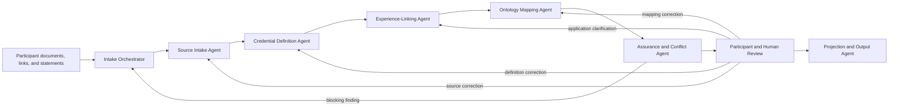
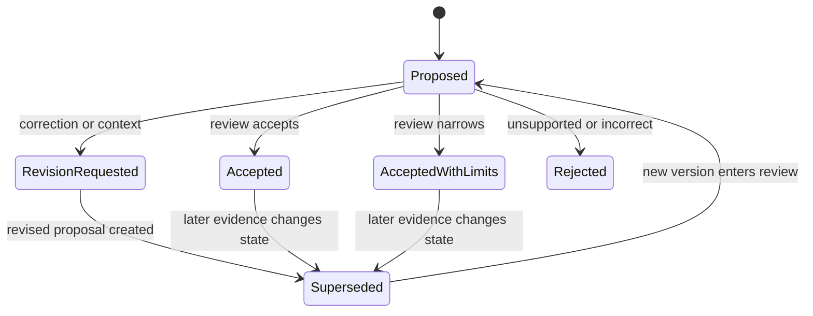

# PIA Intake Subsystem Framework

> **Development state: IN PROGRESS — SUBJECT TO CHANGE.**
> This is working, proposed architecture at Formulation. Responsibilities,
> records, state vocabularies, interfaces, implementation phases, and
> promotion requirements may change through contract, privacy, security,
> ontology, assurance, participant-review, and governance work. Partial
> implementations do not make it a complete subsystem or an accepted
> authority.

## Status and purpose

This document proposes the architecture for a participant-centered intake
subsystem that can receive documents, links, structured statements, and
feedback; preserve their provenance; resolve credential definitions; connect
preparation to experience without collapsing the two; and produce reviewable
inputs for PIA analysis.

It is a working framework under active development, not an implemented
service or promoted contract.
It defines responsibility boundaries and candidate records so that later
software can be built without allowing implementation convenience to create
new domain meaning.

The framework depends on:

- the [PIA Measurement Doctrine](../../governance/PIA_MEASUREMENT_DOCTRINE.md);
- the
  [PIA Behavioral Capability Inference Principle](../../principles/PIA%20Behavioral%20Capability%20Inference%20Principle.md);
- the
  [PIA Capability and Pattern Profile](../../ontology/PIA_CAPABILITY_PATTERN_PROFILE.md);
- the
  [OSI-PIA Data and Graph Contract](../../docs/contracts/OSI_PIA_Data_Graph_Contract_v0.1.md);
- the
  [PIA Capability Evidence Mapping Profile](../../docs/contracts/PIA_Capability_Evidence_Mapping_Profile_v0.2.md);
- the
  [OSI-PIA Import Contract](../../docs/contracts/OSI_PIA_Import_Contract_v0.1.md);
- the [PIA Reference Database](../graph_ontology/PIA_Reference_Database.md);
- the
  [PIA Credential Definition Library](PIA_Credential_Definition_Library.md);
- the
  [PIA Protected Evidence Extraction Profile](PIA_Protected_Evidence_Extraction_Profile.md);
  and
- the [OSI-PIA Governance Model](../../governance/GOVERNANCE_MODEL.md).

When this framework and an upstream authority differ, the upstream authority
governs.

## Architectural problem

The existing participant package can preserve a credential-completion record,
but a title alone does not answer:

- what the issuer assessed;
- which version or body of knowledge applied;
- whether prerequisites included experience;
- how the preparation relates to the capability ontology;
- whether the participant applied it in a particular context;
- what source supports the application connection; or
- how the participant corrected the system's interpretation.

A flat import queue cannot safely answer these questions. The intake subsystem
must represent the transitions from submitted material to proposed meaning,
review, and graph projection without treating any transition as
self-validating.

## Governing design rules

1. **Intake is a governed evidence process, not a file-upload feature.**
2. **Original material, extracted content, definitions, application claims,
   and analytical mappings remain distinct records.**
3. **Every transformation preserves its source, method, version, time, and
   responsible actor or agent.**
4. **Unknown, inaccessible, conflicting, or obsolete definitions remain
   explicit queue conditions.**
5. **A credential definition may establish assessed scope; it does not
   establish participant application or performance.**
6. **Participant feedback is append-only history, not an unlogged overwrite.**
7. **An agent may propose only within its declared layer and may not promote
   its own proposal.**
8. **Consequential acceptance, rejection, correction, and canonical
   promotion remain human-accountable.**
9. **Participant-derived material remains outside Git and is private by
   default.**
10. **An identical input and method version should produce the same stable
    records or an explained variance finding.**

## Scope

The proposed subsystem includes:

- intake-session creation and purpose declaration;
- consent and processing-boundary checks;
- private document upload;
- participant-submitted and reviewer-submitted links;
- source acquisition and integrity metadata;
- extraction and normalization proposals;
- duplicate and source-dependence detection;
- credential-definition resolution;
- education-to-experience linkage proposals;
- capability-mapping proposals;
- clarification requests;
- participant and human-review feedback;
- assurance findings;
- sandbox projection manifests; and
- auditable handoff to analysis and reporting.

It does not define:

- a user-interface visual design;
- permanent storage technology;
- authentication implementation;
- autonomous acceptance of evidence;
- a universal credential authority;
- automatic verification of participant performance;
- production deployment; or
- canonical graph promotion.

## Epistemic object separation

| Object | Meaning | Must not be treated as |
|---|---|---|
| `IntakeSession` | Purpose-bounded collection and review episode | Permanent permission for unrelated processing |
| `SubmittedArtifact` | Participant- or reviewer-supplied file or statement | Verified fact merely because it was submitted |
| `ExternalSourceSnapshot` | Retrieved representation of an external source | Timeless or universally authoritative content |
| `ExtractedContent` | Machine- or human-derived text and metadata | The unmodified original |
| `CredentialRecord` | Evidence that a participant reports or documents completion | Complete definition of the credential |
| `CredentialDefinition` | Versioned description of what an issuer or approved source says the credential covers | Proof of participant application or performance |
| `CredentialApplicationAssertion` | Proposed connection between preparation and a work or project context | Proof that the credential caused an outcome |
| `CapabilityMappingProposal` | Reviewable analytical relationship to a capability | Accepted participant identity or permanent trait |
| `ClarificationRequest` | Question required to resolve missing or ambiguous meaning | Evidence that an answer exists |
| `ReviewEvent` | Versioned participant or reviewer response to a proposal | Destructive edit of the prior proposal |
| `AssuranceFinding` | Contract, provenance, conflict, privacy, or inference-boundary result | Domain evidence about the participant |
| `ProjectionManifest` | Exact approved or proposed records selected for a graph write | Authority to change unrelated graph state |

## Layered agent model

An agent is a bounded processing role. It may be implemented by software, an
AI-assisted process, a human workflow, or a combination. Agent identity does
not grant epistemic or governance authority.



### Intake Orchestrator

The orchestrator creates the intake session, declares purpose, confirms the
processing boundary, routes work, and records state transitions. It does not
extract domain meaning, accept mappings, or write participant assertions to
the graph.

### Source Intake Agent

The Source Intake Agent:

- receives uploads, links, and structured statements;
- records file and source metadata;
- calculates integrity checksums;
- classifies confidentiality;
- detects probable duplicates;
- preserves the original/derived distinction;
- performs or requests safe text extraction; and
- creates clarification requests for unreadable, unsupported, or ambiguous
  material.

It may not treat extracted content as verified, resolve capability meaning, or
discard an original artifact after deriving text.

### Credential Definition Agent

The Credential Definition Agent:

- identifies the credential and issuing body;
- locates or receives the applicable issuer definition;
- records version, effective date, retrieval date, and source;
- extracts assessed domains, prerequisites, and renewal conditions;
- identifies conflicting, inaccessible, obsolete, or title-only definitions;
- proposes a bounded domain scope and negative boundary; and
- maintains the credential-definition expansion queue.

It may not claim participant completion, application, proficiency, or outcome
quality from issuer material.

### Experience-Linking Agent

The Experience-Linking Agent:

- compares credential or course content with listed experiences;
- distinguishes explicit source attribution from topical alignment;
- proposes `CredentialApplicationAssertion` records;
- identifies relevant work artifacts, results, or witnesses;
- creates participant questions where the connection remains ambiguous; and
- preserves causal and source-independence limits.

It may not infer application merely because a capability appears in both an
educational record and an experience.

### Ontology Mapping Agent

The Ontology Mapping Agent:

- maps resolved definitions and application assertions to working capability
  identifiers;
- states evidence role, claim scope, inference level, confidence basis, and
  negative boundary;
- identifies missing ontology coverage;
- proposes new-pattern research without creating new canonical capabilities;
  and
- produces contract-shaped mapping proposals.

It may not accept its own mapping, create personality classifications, or
convert missing evidence into absence of capability.

### Assurance and Conflict Agent

The Assurance and Conflict Agent:

- validates record contracts and stable identity;
- checks provenance, source dependence, duplicates, and version conflicts;
- detects overconfident or out-of-scope inference;
- checks consent, confidentiality, retention, and purpose boundaries;
- compares agent outputs with their declared permissions;
- quarantines blocking conflicts; and
- produces reproducible findings and safe next actions.

It may block or route work but may not rewrite evidence or resolve a semantic
dispute by deleting one side.

### Participant and Human Review

Review is an accountable workflow, not an autonomous agent decision.
Participants and authorized reviewers can:

- accept a proposal;
- accept it with narrower scope;
- reject it;
- request revision;
- supply additional context or evidence;
- identify a source or identity error;
- dispute an inference;
- state that they do not know; or
- withdraw or limit processing authorization.

Review creates `ReviewEvent` records. Prior proposals remain traceable and are
superseded rather than overwritten.

The working
[Quick Credential Check-in prototype](../../software/intake-ui/README.md)
demonstrates this checkpoint with synthetic data. It presents a short queue of
credential definitions that are ready for participant review, separates them
from records that still need a source, and reduces each immediate decision to
applied in work, preparation only, or correction needed. Note, link, file,
skip, and return paths remain available but optional. Its input is
intentionally transient: the prototype does not upload, persist, accept,
project, or write participant information. Durable input remains a later
local-private intake responsibility.

#### Rapid credential review pattern

A participant may have dozens of trainings, licenses, courses, and
certifications. Review must therefore minimize time burden without collapsing
evidentiary distinctions.

The proposed rapid-review pattern is:

```text
1. Check a short supported meaning and its negative boundary
2. Choose the closest bounded response
3. Continue to the next ready credential
```

The default response set is:

```text
applied_in_work
preparation_only
correction_needed
```

The interface should:

- show counts for recognized, source-needed, and participant-review items;
- queue only definitions ready for a meaningful participant choice;
- keep unresolved or version-unknown credentials visible without requiring
  the participant to research them during the session;
- ask one decision at a time and advance without requiring narrative text;
- preserve optional detail, evidence, correction, skip, return, and
  save-for-later paths;
- allow a later batch or reviewer-assisted resolution path;
- explain that completion progress is not a capability score, ranking, or
  confidence measure; and
- write each durable response as a scoped, append-only `ReviewEvent`, not as
  an overwrite of the credential definition or application assertion.

An `applied_in_work` response is participant-supplied context. It can trigger
experience-linking review but does not independently prove performance,
causation, authority, or outcome quality. A `preparation_only` response
preserves the credential's educational value without implying application. A
`correction_needed` response routes the definition or participant linkage for
review and leaves the earlier proposal traceable.

#### Automation-first batch credential intake

**Status: planned — not implemented.**

The manual credential-entry and review surfaces are fallback and accountable
review controls. They are not the intended default experience for a
participant with a large collection of courses, trainings, licenses, badges,
and certifications.

The planned batch flow should:

1. extract source-grounded credential descriptors from authorized documents;
2. preserve the source artifact and locator for every descriptor;
3. normalize likely title, issuer, version, and credential type;
4. group exact duplicates and related versions without erasing provenance;
5. check the accepted credential library before asking the participant;
6. route known definitions without manual re-entry;
7. assign public-reference gaps to the definition-expansion queue; and
8. present the participant only with ambiguous items that require information
   they are uniquely positioned to provide.

The participant-facing summary should use a low-burden queue such as:

```text
12 understood automatically
3 need one detail
1 requires manual review
```

Questions should normally request only an exact issuer, version or year, or
title distinction. The participant must be able to defer an item, mark it not
important for the current purpose, or supply optional supporting material.
Batch progress is an intake status, not an assessment score.

Automatic recognition may propose a credential descriptor or reuse a public
definition. It does not establish completion, current standing, application,
proficiency, or performance. The current protected manual-entry screen remains
the operational fallback until this planned extraction, grouping, and
exception-queue linkage is implemented and validated.

### Projection and Output Agent

The Projection and Output Agent:

- receives an explicit projection manifest;
- checks that required assurance gates passed;
- writes only the declared records to the intended sandbox or governed graph;
- records import identity, method version, and counts;
- runs post-write validation;
- produces participant-facing and technical outputs; and
- preserves the distinction between proposed and accepted assertions.

It may not use a report to promote a graph assertion or write output files
back as new participant evidence without a separate intake event.

#### Optional report-to-document handoff

A completed participant-facing report may offer a voluntary transformation
step for LinkedIn profiles, résumés, CVs, or later approved document types.
This is an output workflow, not a new source-evidence interpretation.

```text
accepted report
  -> participant chooses a target document
  -> PIA proposes evidence-bounded wording
  -> participant edits, accepts, or rejects each suggestion
  -> PIA creates a separate draft
  -> participant copies, downloads, or abandons the draft
```

The workflow must:

- remain optional and allow the participant to keep the report unchanged;
- identify the exact report version and target-document version used;
- preserve current wording alongside every proposed change;
- link each suggestion to accepted report statements and their evidence;
- prevent suggestions from exceeding the accepted claim strength;
- allow independent edit, accept, reject, defer, and abandon decisions;
- preserve the original document without automatic overwrite;
- require a separate, explicit action before any external publishing;
- keep generated wording and exports outside the evidence graph unless they
  later enter through a distinct authorized intake event; and
- record durable transformations in a scoped manifest when persistence is
  implemented.

A future transformation manifest should identify:

```text
transformation_id
participant_scope
accepted_report_id
accepted_report_version
target_document_type
target_source_artifact_id
target_source_version
transformation_method_version
suggestion_ids
per_suggestion_dispositions
supporting_assertion_ids
output_draft_id
created_at
approved_at
published_at_or_null
```

Approval of wording means that the participant accepts the wording for the
selected draft. It does not independently verify the underlying capability,
promote an assertion, or establish that the wording was published.

#### Executive summary and full-report composition

The participant overview or executive summary is a shorter presentation layer
over the accepted full report. It must not become a competing interpretation
or a second source of truth.

The participant may:

- view the full report independently of the executive summary;
- add or remove the executive summary from a working report composition;
- see the current inclusion state before export; and
- return from either report view to optional document drafting.

Executive-summary inclusion is a presentation choice. It does not change
assertion status, evidence strength, confidence, knowledge state, or graph
projection. A durable report manifest should record the full-report version,
executive-summary version, inclusion disposition, participant or reviewer
decision event, composition method version, and exported artifact identity.

#### Optional technical evidence companion

A participant-facing report may provide a separate technical companion showing
how report interpretations relate to the assured evidence state. The
participant may preview the companion without adding it to the report and may
add or remove it before export.

The companion may report bounded, method-versioned measures such as:

- working confidence for each interpretation;
- number of supporting evidence references;
- direct, corroborating, contextual, or preparation-only evidence counts;
- number and kind of source groups;
- unresolved conflicts, missing definitions, or review gates; and
- the most useful next evidence or clarification for each interpretation.

These measures describe the evidence state. They are not participant
performance scores, percentile ranks, universal capability measures, or
comparisons with other people. A durable composition manifest should record the
technical-companion version, calculation-method version, underlying assured
state identity, inclusion disposition, and export identity.

#### Privacy commitment presentation

Participant-facing intake and report surfaces must provide a visible,
plain-language path to the governing privacy commitments. The presentation must
distinguish:

- safeguards the current component actually implements;
- safeguards supplied by its deployment environment; and
- safeguards that remain requirements before production participant intake.

The interface must not claim encrypted retained storage merely because delivery
uses an encrypted transport connection. Prototype session-only processing,
browser-created downloads, repository participant-data exclusion, remote
processing, persistence, retention, withdrawal, and deletion boundaries must be
stated separately. Participant correction and evidence-update paths should be
actionable rather than described only as `reviewable`.

#### Participant start and initial-document staging

The participant-facing process should begin before credential explication with
a bounded intake-session start. The initial surface should:

- avoid requiring a legal name, email address, or other direct identifier when
  a private participant label is sufficient;
- show the declared purpose and current privacy boundary before document
  selection;
- accept multiple initial source types without treating selection as completed
  intake or evidence acceptance;
- capture a participant-supplied document-type classification for each selected
  file and allow that classification to be corrected before staging;
- let the participant inspect and remove the staged selection;
- provide a path to continue without documents;
- separate prototype browser-only selection from durable private staging; and
- state whether a selected document is uploaded, retained, analyzed, or
  transferred to another processing component.

In a durable implementation, each accepted file must enter through the Intake
Session and Source Artifact contracts. Consent or other authorization,
integrity, malware inspection, purpose, retention, confidentiality,
source identity, and permitted-processing state must be established before
extraction. A page transition or visible filename is not evidence that a
document was securely staged or admitted to analysis.

Participant-supplied document type is provisional intake metadata. It may route
later explication but must not by itself establish artifact meaning, evidence
role, ontology mapping, confidence, or acceptance.

## Agent permission matrix

| Role | May create | May revise by supersession | Must not do |
|---|---|---|---|
| Intake Orchestrator | Session, task, routing, transition record | Routing and task state | Interpret evidence or accept findings |
| Source Intake | Source manifests, snapshots, extracted-content proposals | Derived source records | Delete originals or verify domain claims |
| Credential Definition | Definition proposals and definition findings | Definition proposal versions | Assert participant application |
| Experience Linking | Application assertions and clarification requests | Linkage proposal versions | Treat topical overlap as proof |
| Ontology Mapping | Capability-mapping proposals and ontology-gap notices | Mapping proposal versions | Create canonical ontology or accept mappings |
| Assurance and Conflict | Findings, quarantine records, gate results | Finding disposition through documented review | Alter source evidence |
| Participant/Human Review | Review events, corrections, scope decisions | Review disposition through a new event | Erase prior states |
| Projection and Output | Projection manifests, import audits, reports | Superseding projection or report version | Expand manifest scope or promote authority |

## Intake records and working contract package

The framework requires separate record contracts rather than one unbounded
intake table. Phase 1 now represents these distinctions in one working,
versioned package so their relationships can be tested together.

| Contract area | Primary records | Initial responsibility |
|---|---|---|
| Intake Session Contract | `IntakeSession`, purpose, consent basis, retention, participant scope | Orchestrator |
| Source Artifact Contract | `SubmittedArtifact`, `ExternalSourceSnapshot`, `ExtractedContent` | Source Intake |
| Credential Definition Contract | `CredentialRecord`, `CredentialDefinition`, definition source and status | Credential Definition |
| Application Assertion Contract | Education-to-experience linkage, basis, limit, supporting artifact references | Experience Linking |
| Intake Review Contract | `ClarificationRequest`, `ReviewEvent`, dispute and correction history | Review workflow |
| Intake Assurance Contract | `AssuranceFinding`, gate result, quarantine reason, safe next action | Assurance |
| Projection Manifest Contract | Exact records, versions, checksums, target, mode, approvals, and post-write result | Projection |

The working, proposed
[PIA Intake Phase 1 Record Contract](../../docs/contracts/PIA_Intake_Phase_1_Record_Contract_v0.1.md)
now defines these seven record types and the credential-definition queue view.
It remains at Formulation and does not authorize production intake, real
participant fixtures in Git, autonomous acceptance, or graph writes.

## Document-upload handling

Uploaded files remain in participant-controlled private storage outside Git.
For each upload, intake should record:

```text
artifact_id
intake_session_id
participant_id
submitted_by
original_filename
media_type
byte_size
checksum
collected_at
confidentiality
consent_scope
purpose
local_or_private_storage_reference
malware_scan_status
extraction_status
retention_class
```

The original file is immutable. OCR, transcription, redaction, and
normalization produce new derived records linked to the original with method
and version metadata. Sanitization for reporting must not destroy the
restricted original or obscure which transformation occurred.

## Link and external-definition handling

A submitted link is not sufficient provenance by itself. Intake should retain:

```text
submitted_uri
resolved_uri
publisher_or_issuer
page_title
retrieved_at
content_effective_date
credential_version
content_checksum
snapshot_reference
relevant_excerpt_reference
access_status
definition_status
```

The subsystem must not bypass authentication, licensing, robots restrictions,
or access controls. If an authoritative definition cannot be acquired,
`definition_status` remains `source_needed`, `inaccessible`, or
`title_only_unknown`. An authorized participant or reviewer may upload a
lawfully held document instead.

Public credential definitions may enter the proposed
[PIA Credential Definition Library](PIA_Credential_Definition_Library.md)
after review. Participant completion, application, and feedback records
remain participant-scoped and private.

## Credential-definition expansion queue

The current experimental queue demonstrates the minimum need:

- evidence identity;
- credential title;
- issuing authority;
- definition status;
- provisional capability mappings;
- definition source and URI;
- domain scope;
- expansion requirement;
- definition question;
- application question; and
- review status.

A contract-ready queue should additionally include:

```text
queue_item_id
intake_session_id
credential_record_id
credential_definition_id
credential_version
definition_source_ids
submitted_artifact_ids
external_snapshot_ids
processing_state
knowledge_status
review_disposition
priority
assigned_role
attempt_count
last_attempt_at
blocked_reason
next_action
supersedes_queue_item_id
created_at
updated_at
```

### Separate state axes

The queue must not force processing, knowledge, and review into one ambiguous
status.

**Processing state**

```text
received
preflight
in_progress
waiting_for_input
ready_for_review
ready_for_projection
projected
closed
blocked
```

**Knowledge status**

```text
title_only_unknown
source_needed
source_defined
issuer_verified
participant_defined
conflicting_definition
obsolete_definition
inaccessible_definition
```

**Review disposition**

```text
pending
accepted
accepted_with_limits
revision_requested
rejected
disputed
superseded
```

An item can therefore be `waiting_for_input`,
`conflicting_definition`, and `pending` without losing any of those meanings.

## Feedback and correction loop

Every question and response should be addressable to a specific proposal,
field, or source.



A `ReviewEvent` should record:

```text
review_event_id
target_record_id
target_record_version
actor_role
actor_id_or_pseudonymous_reference
disposition
field_scope
reason
response_text
supporting_source_ids
created_at
supersedes_review_event_id
```

Participant feedback has special evidentiary value for correcting personal
context and application claims. It does not automatically erase conflicting
records or convert a self-report into independent corroboration. Both the
feedback and the conflict remain representable.

## Workflow and gates

```text
1. Session and purpose declared
2. Consent and privacy preflight
3. Artifact or link received
4. Integrity and provenance captured
5. Extraction or normalization proposed
6. Credential definition resolved or queued
7. Application linkage proposed or questioned
8. Capability mapping proposed
9. Assurance and conflict checks
10. Participant and accountable human review
11. Explicit projection manifest
12. Sandbox or governed import
13. Post-write validation
14. Participant-facing and technical outputs
15. Correction, supersession, or closure
```

Blocking gates include:

- absent or withdrawn authorization for the requested purpose;
- malware or unreadable-file handling failure;
- missing source identity where provenance is required;
- conflicting immutable identity;
- changed content under an existing checksum or package identity;
- unresolved protected-field conflict;
- agent action outside its permission boundary;
- missing required review for a consequential assertion; and
- a projection manifest that does not exactly match the proposed write set.

## Agent interface contract

Every agent implementation must follow the existing
[system-pipeline interface](../../docs/architecture/OSI_System_Pipeline.md) and
declare:

1. accepted record types and versions;
2. required preconditions;
3. emitted record types and versions;
4. validation errors, warnings, and review notices;
5. allowed side effects;
6. idempotency key and rerun behavior;
7. audit fields, method version, and run identity;
8. failure and quarantine behavior;
9. human-review triggers; and
10. prohibited actions.

Agent outputs should be replayable from their declared inputs. Model-assisted
work must additionally retain the model or method identifier, prompt or task
profile, source set, output record, and reviewer disposition where permitted
by privacy policy.

## Orchestration and authority

The orchestrator may route and sequence work, but it is not a semantic
super-agent. It cannot:

- accept definitions on behalf of the definition reviewer;
- infer application on behalf of the linking agent;
- accept mappings on behalf of the participant or human reviewer;
- waive assurance findings;
- expand a projection manifest; or
- promote a working artifact or ontology definition.

An agent's output may be consumed by a later layer only when the output
contract and required gate state permit that transition.

## Graph boundary

The subsystem prepares graph-ready records; it does not make the graph the
intake source of truth.

- Restricted originals remain in private source storage.
- The participant graph may receive contracted source, evidence, experience,
  reviewable mapping, and audit records.
- Proposed assertions retain proposal and review metadata.
- Rejected or superseded assertions remain traceable but must not appear as
  current findings.
- Reusable public credential definitions may be governed separately from
  participant records.
- The reference graph receives vocabulary, schema, migrations, and synthetic
  validation fixtures—not participant datasets.
- Participant reports and technical outputs remain outside Git and the graph
  unless a separate governed intake explicitly treats an output as a new
  source.

## Privacy, security, and participant agency

The subsystem must:

- apply least-privilege access by agent role;
- minimize participant content in logs and task messages;
- keep credentials, tokens, and private links out of record content;
- separate restricted originals from sanitized views;
- prevent participant data from entering the tracked repository;
- bind collection and processing to a declared purpose;
- preserve consent limits and withdrawal;
- support correction, dispute, export, and retention workflows;
- avoid silent external transmission to an AI or third-party service; and
- record when remote processing is authorized and used.

PII sanitization creates a safer working representation. It does not change
the confidentiality of the original or authorize broader use.

## Assurance requirements

The intake subsystem should eventually provide reproducible checks for:

- every received item has a disposition;
- every derived record traces to an original or declared source;
- checksums and immutable identities remain stable;
- every credential definition has a knowledge status;
- every title-only or conflicting definition has a next action;
- issuer-verified definitions retain source, version, and retrieval metadata;
- every application assertion distinguishes explicit attribution from topical
  alignment;
- every mapping retains evidence role, claim scope, inference level,
  confidence basis, and negative boundary;
- every review decision is append-only and version-addressable;
- rejected and superseded proposals are excluded from current output;
- every graph write matches an approved projection manifest;
- participant-data exclusion from Git remains intact; and
- synthetic fixtures cover successful, ambiguous, conflicting, withdrawn,
  inaccessible, and correction-loop cases.

## Initial implementation sequence

### Phase 1 — Record and queue contracts

**Status: started — working/proposed — subject to change.**

- [Implemented for synthetic validation] Define Intake Session, Source
  Artifact, Credential Definition, Application Assertion, Review Event,
  Assurance Finding, and Projection Manifest contracts.
- [Implemented for synthetic validation] Extend the experimental credential
  queue into a contract-shaped, participant-free fixture.
- [Implemented for synthetic validation] Define stable IDs, separate
  processing/knowledge/review state axes, and supersession behavior.
- [Implemented for synthetic validation] Add a standard-library validator and
  negative tests for participant-data exclusion, source requirements, review
  targets, projection scope, and supersession.

Phase 1 is not complete or promoted. Contract, privacy, security, ontology,
assurance, participant-review, and governance review remain required before
the implementation can advance beyond reversible local development.

### Phase 2A — Local synthetic intake

**Status: implemented for synthetic validation — working/proposed.**

- Create intake sessions only after purpose, scope, consent, confidentiality,
  and retention preflight.
- Stage supported synthetic uploads in an explicitly configured local store
  outside the repository.
- Preserve provenance and document-type metadata, calculate SHA-256 checksums,
  detect exact within-session duplicates, and maintain append-only audit
  events.
- Provide a localhost-only manual intake page and reproducible stored-content
  validation.

### Phase 2B — Participant-ready protection controls

**Status: implemented working candidate — operational review required.**

- Protect the store master key with current-user Windows DPAPI.
- Encrypt each participant session with a separate AES-256-GCM data key and
  encrypt metadata, artifacts, and detailed audit events at rest.
- Require and verify a separately located, passphrase-encrypted recovery
  bundle during initialization.
- Restrict the store directory to the initializing Windows user and `SYSTEM`.
- Authenticate local owner and reviewer accounts, enforce bounded roles, use
  memory-only browser sessions, require per-session CSRF tokens, and throttle
  failed login attempts.
- After fresh authentication, expose a bounded minimal index of active
  protected sessions and allow an authorized user to resume one session
  without recreating or splitting its evidence and credential history.
- Audit session-index access and each deliberate session-resumption event;
  restore only the working document, evidence-review, and credential context
  required for continuation.
- Permanently retire every deleted session identifier, include tombstones in
  future identifier allocation, fail closed on active/tombstoned collisions,
  and refresh cached active-session views after lifecycle actions.
- Inspect document bytes in memory with Windows AMSI before encrypted storage;
  fail closed on detection, policy block, risk result, or scan error.
- Block processing immediately on withdrawal.
- Support owner-controlled key erasure and encrypted-file removal with a
  non-content tombstone.
- Preview and execute finite 30-, 90-, and 365-day retention policies.
- Validate encrypted content, checksums, audit-chain integrity, authorization
  state, retention deadlines, and storage containment.

The working
[Phase 2B Protection Profile](PIA_Phase_2B_Protection_Profile.md)
defines the implemented controls, limits, and controlled-pilot gate. Actual
participant intake remains subject to that operational recovery, privacy,
security, consent, and governance review. Phase 2B does not authorize network
exposure, remote processing, production deployment, credential explication,
graph projection, or Neo4j writes.

Link submission and snapshotting, Phase 1 package export, correction/export
propagation, and downstream-output deletion remain unimplemented.

### Protected evidence extraction and review

**Status: first local extraction and review increment implemented —
working/proposed.**

- [Implemented] Require explicit `evidence_extraction` scope, open consent,
  valid retention, authenticated access, and source integrity.
- [Implemented] Decrypt one staged artifact in memory without creating a
  plaintext staging file.
- [Implemented] Safely extract bounded TXT, CSV, RTF, DOCX, and selectable PDF
  content without executing formulas, macros, objects, relationships, links,
  scripts, or archives.
- [Implemented] Route legacy DOC, general ZIP, password-protected PDF,
  image-only PDF, malformed input, and parser-limit failures to a bounded
  manual-preparation or review path.
- [Implemented] Create source-grounded, `unreviewed` Evidence candidates with
  stable IDs, source locators, neutral evidence types, and an explicitly empty
  capability-assertion output.
- [Implemented] Encrypt complete extracted text separately and retain
  candidates and append-only review events in the encrypted session.
- [Implemented] Allow authorized local users to keep, correct, exclude, or
  dispute candidates while preserving original extracted wording.
- [Implemented] Block downstream eligibility until a candidate has been
  reviewed and explicitly included.
- [Implemented] Validate extraction ciphertext, checksums, identity,
  provenance, candidate boundaries, review-event targets, and lifecycle
  containment.

This increment is governed by the
[Protected Evidence Extraction Contract](../../docs/contracts/PIA_Protected_Evidence_Extraction_Contract_v0.1.md)
and the
[Protected Evidence Extraction Profile](PIA_Protected_Evidence_Extraction_Profile.md).
It does not perform OCR, remote processing, credential discovery, application
linkage, capability mapping, report generation, or graph projection.

### Phase 3 — Credential definition resolution

**Status: participant-free resolution, Phase 3A independent review, and the
complete manual Phase 3B protected linkage implemented — working/proposed.**

- [Implemented] Define a normalized public catalog for issuer, family,
  definition, source, domain, review, and expansion-queue records.
- [Implemented] Preserve public source retrieval metadata, content
  fingerprints, version boundaries, domain summaries, and negative boundaries.
- [Implemented] Resolve exact titles, acronyms, aliases, issuer hints, version
  hints, and effective dates without treating those matches as participant
  evidence.
- [Implemented] Detect title collisions, unresolved versions, inaccessible
  sources, definition conflicts, supersession defects, and participant-data
  leakage.
- [Implemented] Add a review-pending ASIS PSP definition candidate based on
  issuer-primary material. It is deliberately not `issuer_verified` until an
  independent reviewer records acceptance.
- [Implemented] Add accountable proposal/reviewer identities and block
  self-review.
- [Implemented] Add preview-first accept, accept-with-limits, revise, reject,
  and dispute transitions for a complete definition/source/domain package.
- [Implemented] Add a localhost Phase 3A workbench that is preview-only by
  default and requires explicit write enablement and confirmation.
- [Implemented] Add locking, staged validation, rollback, append-only review
  history, annual review metadata, and installed-state revalidation.
- [Implemented Phase 3B.1] Define an exact allow-listed participant-free
  lookup contract that rejects unknown and participant-scoped fields.
- [Implemented Phase 3B.1] Check the accepted PIA catalog before participant
  clarification or external source research.
- [Implemented Phase 3B.1] Route resolved, pending-review, version-unknown,
  ambiguous, source-needed, inaccessible, and conflicting outcomes without
  persistence or network access.
- [Implemented Phase 3B.2] Add the optional numbered Credential Engine
  connector with server-side secrets, allowlisted endpoints, bounded search,
  normalized candidates, provenance, and Phase 3A review routing.
- [Implemented Phase 3B.3] Connect the protected intake store through a
  newly constructed minimized request while retaining the private relationship
  and audit linkage only in the encrypted session.
- [Implemented Phase 3B.4] Add targeted issuer/version clarification,
  encrypted clarification history, and catalog-first return routing to the
  authenticated participant-intake interface.
- [Remaining] Add governed issuer-source acquisition and extraction
  orchestration, source-change events, and a small independently reviewed
  public catalog.

The implementation is governed by the
[PIA Credential Definition Catalog Contract](../../docs/contracts/PIA_Credential_Definition_Catalog_Contract_v0.2.md)
and the
[Phase 3A Credential Review Profile](PIA_Phase_3A_Credential_Review_Profile.md).
Phase 3B lookup is governed by the
[Credential Lookup Request Contract](../../docs/contracts/PIA_Credential_Lookup_Request_Contract_v0.1.md)
the
[Credential Resolution Linkage Contract](../../docs/contracts/PIA_Credential_Resolution_Linkage_Contract_v0.1.md),
and the
[Phase 3B Credential Lookup Profile](PIA_Phase_3B_Credential_Lookup_Profile.md).
It does not yet authorize credential-to-capability crosswalks, participant
application findings, or graph projection.

### Phase 4 — Application linkage and feedback

- Implement experience linkage, clarification questions, participant review,
  corrections, disputes, and supersession.
- Preserve explicit attribution separately from topical alignment.

### Phase 5 — Ontology mapping and assurance

- Emit mapping-profile-compliant proposals.
- Validate agent boundaries, overreach, conflict, source dependence, and
  participant-review requirements.

### Phase 6 — Projection and outputs

- Generate exact projection manifests.
- Add dry-run, apply, and post-import validation for the sandbox.
- Generate participant-facing and technical reports from the same assured
  state.

## Open design decisions

The following require later contracts or ADRs:

- production storage placement, backup, and recovery design;
- local-only versus approved remote model processing;
- production participant and reviewer identity integration;
- issuer-page snapshot retention and licensing;
- whether a public credential-definition catalog is graph-backed;
- definition-review stewardship and renewal intervals;
- notification and response-time behavior for clarification requests;
- conflict escalation and appeal;
- data-export and deletion mechanics;
- retention after participant withdrawal; and
- criteria for moving from sandbox projection to governed production use.

## Promotion boundary

This framework may advance beyond formulation only when:

- its candidate record contracts exist and are registered;
- an ADR records the accepted agent authority model;
- privacy and threat-model review is complete;
- synthetic end-to-end fixtures exercise correction and conflict paths;
- agent permission violations are reproducibly blocked;
- review events and projections can be replayed from audit records;
- repository validation confirms no participant data is tracked; and
- accountable PIA, ontology, graph, assurance, and governance stewards approve
  the transition.

Until then, implementations may use this document for reversible sandbox
experiments but must not describe the subsystem as canonical or production
ready.
