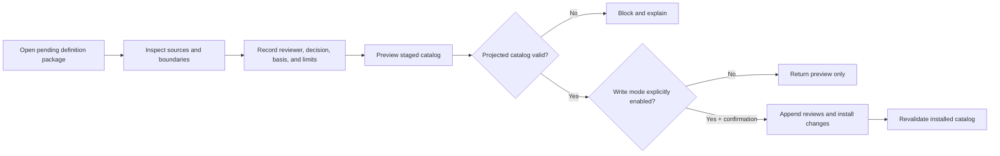

# PIA Phase 3A Credential Review Profile

> **Development state: IN PROGRESS — SUBJECT TO CHANGE.**
> Phase 3A is a participant-free local review workflow. It does not authorize
> production deployment, participant processing, autonomous definition
> acceptance, capability mapping, graph projection, or public publication of
> the catalog.

## Purpose

Phase 3A turns a sourced credential-definition candidate into an accountable,
reviewable package. It gives an independent reviewer a fast way to inspect:

- the issuer and credential identity;
- the bounded definition and negative boundary;
- public source links, locators, retrieval metadata, fingerprints, and size;
- assessed domain elements and weights;
- unresolved version, date, conflict, and source limits; and
- the exact catalog changes a decision would make.

The workflow addresses one question:

> Is this participant-free reference definition sufficiently supported and
> bounded for reusable credential-meaning resolution?

It does not determine whether any person earned, retained, applied, or
performed the credential.

## Phase boundary

Phase 3 is divided into two controlled increments:

| Increment | Responsibility | Participant material |
|---|---|---|
| Phase 3A | Independent review of public definition packages | Prohibited |
| Phase 3B | Minimized promotion of unresolved reference questions from protected intake | Remains private; only approved participant-free questions may cross |

Phase 3A does not read the Phase 2B protected store. Phase 3B must be designed
and validated separately before the two workflows are connected.

## Accountable roles

| Role or actor | May | Must not |
|---|---|---|
| Credential Definition Agent | Propose definition and domain records | Review or accept its own records |
| Source Intake Agent | Propose public source and integrity metadata | Turn source capture into acceptance |
| Credential Definition Reviewer | Accept, limit, revise, reject, or dispute a package | Use participant evidence or review its own proposal |
| Assurance Reviewer | Review contract, provenance, integrity, and boundary compliance | Manufacture missing credential meaning |
| Governance Reviewer | Resolve escalated scope or authority disputes | Erase prior review history |

`proposed_by_actor_id` and `reviewer_actor_id` are accountable process
identities. They must not contain participant identity or contact data.

## Review package

A Phase 3A package contains:

```text
CredentialDefinition
  + related CredentialDefinitionSource records
  + related CredentialDomainElement records
  + participant-free expansion-queue item
  + prior DefinitionReview history, when present
```

Issuer and family identities provide context but are not participant claims.
The current implementation reviews the definition, its sources, and domain
elements as one package and writes a separate review event for each target.

## Decisions and transitions

| Decision | Definition result | Queue result | Reusable resolution |
|---|---|---|---|
| `accepted` | `issuer_verified/accepted` | `closed` | Yes, when all acceptance gates pass |
| `accepted_with_limits` | `issuer_verified/accepted_with_limits` | `closed` | Yes, with recorded limits |
| `revision_requested` | Source-defined and unresolved | `in_progress` | No |
| `rejected` | Rejected from current resolution | `blocked` | No |
| `disputed` | Disputed pending governance resolution | `blocked` | No |

An accepted definition requires:

1. an independent reviewer identity different from every proposal actor in the
   package;
2. an authorized reviewer role;
3. an accountable review basis;
4. confirmation that source and negative-boundary inspection occurred;
5. at least one accessible issuer-primary source;
6. traceable domain elements;
7. no material or unresolved source conflict;
8. an annual review cycle;
9. explicit limits when effective dates or other boundaries are unresolved;
   and
10. a completely valid projected catalog.

Because the current ASIS PSP candidate does not state complete effective
boundaries, Phase 3A prevents unqualified `accepted` disposition. A reviewer
may choose `accepted_with_limits` if the remaining uncertainty is explicitly
bounded, or request revision.

## Preview and apply

The review service is preview-first:



Preview copies the current catalog to a temporary staging area, applies the
proposed transition there, and runs the complete catalog validator. Preview
does not change the source catalog.

Apply requires:

- localhost execution;
- server startup with `--allow-catalog-writes`;
- the in-memory local request token;
- a successful preview;
- an explicit apply confirmation;
- a single-writer catalog lock;
- pre-install validation;
- per-file atomic replacement with rollback on installation failure; and
- post-install validation.

The CSV review history is append-only. A later review links to the prior review
through `supersedes_credential_definition_review_id`; it does not delete the
earlier decision.

## Local workbench boundary

The workbench binds to `127.0.0.1:8790`. It:

- starts in preview-only mode;
- uses no remote scripts, styles, analytics, or AI service;
- provides security headers and a restart-invalidated local request token;
- opens public issuer links only when the reviewer chooses;
- shows content fingerprints rather than storing source PDFs; and
- never connects to participant intake, Neo4j, or the hosted participant
  prototype.

The local token is a same-process request safeguard, not production reviewer
authentication. The reviewer actor ID is currently entered by the reviewer
and validated for separation and record consistency, but it is not bound to an
authenticated organizational identity. Independent assignment and identity
accountability therefore remain an operational requirement during controlled
local review. Authenticated reviewer identity is required before multi-user,
remote, or production use.

## Review cycle and change events

The initial review cycle is annual, measured from `last_reviewed`.
Event-driven review is also required before the annual date when:

- an issuer changes the applicable source document or URI;
- a retrieved source fingerprint changes;
- eligibility, assessed domains, weighting, or exam format materially changes;
- a source becomes inaccessible or is withdrawn;
- a title, acronym, version, or effective period changes;
- a conflict or correction is reported; or
- the governing ontology or inference boundary changes in a way that affects
  reuse.

Automated source-change monitoring remains unimplemented. Phase 3A records the
review date and annual cycle so that later monitoring can be reproducible.

## Validation

Phase 3A validation covers:

- exact contract headers and required identities;
- valid proposal and reviewer actor IDs;
- no self-review;
- source integrity and HTTPS boundaries;
- source-to-definition and domain-to-source traceability;
- accepted source, domain, and definition review consistency;
- explicit limits for limited acceptance;
- collision, effective-date, conflict, and supersession safeguards;
- preview non-mutation;
- write-mode and confirmation gates;
- applied review replay into a resolved reference result; and
- absence of participant-scoped fields, signatures, and claims.

## Remaining before Phase 3B

- define the minimized protected-to-public question contract;
- prove that participant identifiers, dates, notes, paths, and private source
  content cannot cross that boundary;
- add accountable approval for creating a public queue item from private
  intake;
- implement duplicate and source-needed queue merging;
- add correction and withdrawal propagation where a public question was
  derived from a protected session; and
- test the complete bridge with synthetic private intake fixtures.
