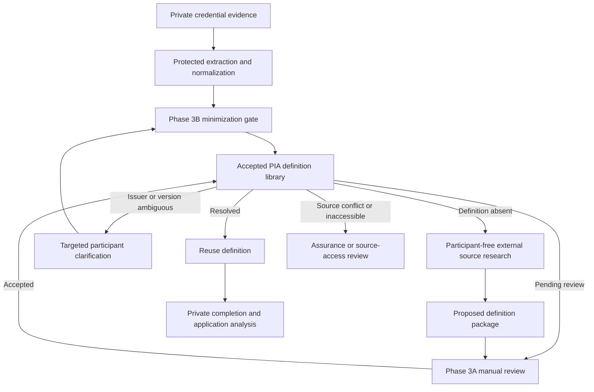

# PIA Phase 3B Credential Lookup Profile

> **Development state: IN PROGRESS — SUBJECT TO CHANGE.**
> Phase 3B now implements catalog-first routing, an optional Credential Engine
> connector, the protected minimization bridge, and targeted clarification.
> The external connector requires separate operational configuration.
> Protected evidence extraction now exists as a separately governed intake
> layer. Phase 3B does not automatically discover credential titles from those
> candidates. Definition acceptance, capability mapping, source acquisition
> beyond bounded search, and graph projection are not implemented or
> authorized here.

## Purpose

Phase 3B reduces repeated credential research and participant burden by
checking reusable reference knowledge before asking for clarification.

Its governing question is:

> Can the credential be resolved through accepted shared reference knowledge,
> or what is the smallest safe next action?

Phase 3B does not determine whether a participant completed, currently holds,
applied, or performed the credential.

## Increment plan

| Increment | Responsibility | Current state |
|---|---|---|
| Phase 3B.1 | Minimized lookup contract and local catalog-first router | Implemented |
| Phase 3B.2 | Approved external registry connectors and candidate normalization | Implemented; operational key required |
| Phase 3B.3 | Protected-intake bridge with explicit minimization gate | Implemented |
| Phase 3B.4 | Targeted participant clarification and return routing | Implemented |

External connectivity must build on the Phase 3B.1 request boundary. A
connector may not broaden the request merely because an external API accepts
more fields.

## Workflow



Only the minimized request crosses from protected participant processing into
reference resolution. The private participant-to-credential relationship,
clarification history, and association with any public candidates remain
encrypted in the protected session.

## Minimized request

Allowed fields are limited to:

```text
credential_title
issuer_hint
version_hint
credential_type_hint
jurisdiction_hint
source_scope
purpose
```

The request excludes participant, session, evidence, certificate-number,
completion-date, document, note, contact, application, performance, and
private-path fields.

Unknown fields are rejected rather than ignored. This prevents a calling
component from assuming that participant content was safely removed when it
was actually passed through under an unexpected field name.

The governing request contract is the
[PIA Credential Lookup Request Contract](../../docs/contracts/PIA_Credential_Lookup_Request_Contract_v0.1.md).

## Catalog-first routing

| Catalog resolution | Routing outcome | Participant question |
|---|---|---|
| `resolved` | `resolved` | None |
| `definition_found_pending_review` | `manual_definition_review` | None |
| `version_unknown` | `confirm_version` | Exact version or named edition only |
| `ambiguous_title` | `ambiguous_credential` | Issuer and exact title only |
| `source_needed` | `external_registry_lookup` | None during public research |
| `inaccessible_definition` | `source_access_review` | None by default |
| `conflicting_definition` | `conflict_review` | None unless review identifies a participant-only distinction |

This routing distinguishes two different kinds of missing information:

- **Public-reference work** belongs to the credential library and its
  reviewers.
- **Participant-specific distinctions** are asked only when the participant
  is uniquely positioned to answer them.

A participant is therefore not asked to research a public certification
definition merely because their intake exposed a library gap.

## Deterministic request identity

Phase 3B.1 normalizes the allowed fields and creates a SHA-256 request
fingerprint. The participant-free request ID derives from that fingerprint.

This provides:

- duplicate lookup recognition;
- reproducible routing tests;
- a stable future cache key;
- no need for participant or session identity; and
- no implication that two people sharing a reference lookup are otherwise
  related.

## Phase 3B.1 execution boundary

The current router:

- validates the local credential catalog before lookup;
- validates every input field and value;
- performs a local PIA catalog lookup;
- returns one governed routing outcome;
- creates no files or database records;
- makes no network request;
- permits no external lookup;
- establishes no participant claim; and
- leaves any expansion-queue proposal unpersisted.

This makes Phase 3B.1 safe to test before external credentials, API keys, or
protected participant records are connected.

## Phase 3B.2 connector

The first implemented external connector is the numbered
[Credential Engine Registry connector](../../connectors/connector-002-credential-engine/).
It uses the official CTDL Search API. CareerOneStop and
jurisdiction-specific regulated qualification registers may follow.

Every connector must:

1. accept only a valid Phase 3B minimized request;
2. keep API keys outside source code, logs, browser responses, and Git;
3. use server-side authenticated requests;
4. declare registry, endpoint, method, connector version, and retrieval time;
5. retain external stable identity and publisher identity;
6. preserve source URI, revision metadata, license or reuse conditions, and
   content fingerprint;
7. distinguish a registry record from issuer-primary verification;
8. return normalized candidates without accepting them;
9. detect multiple plausible records and preserve ambiguity;
10. fail closed on unavailable, malformed, unauthorized, rate-limited, or
    policy-blocked responses; and
11. send every new or materially changed candidate through Phase 3A.

The implementation uses an allowlisted production or sandbox HTTPS endpoint,
an environment-held server key, a ten-result limit, primary-source record
filtering, bounded response size, normalized candidate fingerprints, and
fail-closed error handling. It is disabled unless explicitly enabled when the
protected server starts.

An external match shortens research. It does not grant `issuer_verified`
status by itself.

## Version handling

External registries may expose:

- a named credential version;
- record-update history rather than a semantic credential version;
- only the latest record;
- effective or expiration dates;
- replacement or supersession links; or
- no usable version boundary.

PIA must preserve these distinctions. A registry record revision must not be
silently treated as a new credential version, and a latest record must not be
projected backward onto earlier participant completions.

PIA creates its own immutable `credential_definition_id` for each materially
distinct accepted definition.

## Phase 3B.3 protected bridge

The implemented protected bridge requires:

- authenticated processing purpose must include credential definition;
- withdrawal must block new lookups immediately;
- the minimization gate must construct a new request rather than serialize a
  participant record and remove selected fields;
- prohibited-field validation must run before the request leaves the protected
  boundary;
- the protected audit may record its own private request relationship;
- the participant-free router must not receive that private relationship;
- deletion and correction must propagate through the private side without
  deleting reusable public definitions; and
- external network use must require separately approved connector policy.

## Phase 3B.4 clarification

The implemented clarification flow:

- be generated only for an unresolved distinction the participant can answer;
- ask one bounded question at a time;
- show why the distinction matters;
- accept `unknown` or `skip` without penalty;
- avoid asking the participant to research public issuer material;
- preserve the answer as private participant evidence;
- rerun the minimized lookup without exporting the answer record itself; and
- distinguish participant confirmation from independent issuer verification.

The complete private/public record boundary is governed by the
[Credential Resolution Linkage Contract](../../docs/contracts/PIA_Credential_Resolution_Linkage_Contract_v0.1.md).

## Validation

Phase 3B validation covers:

- exact request allow-list behavior;
- rejection of unknown and participant-scoped fields;
- rejection of participant-like labels, email addresses, and local paths;
- deterministic normalized request identity;
- valid catalog requirement;
- all catalog-to-router state mappings;
- no participant claims;
- no external lookup authorization;
- no persistence;
- resolved-definition reuse;
- pending-definition Phase 3A routing;
- targeted version clarification; and
- participant-free source-research proposals;
- server-side endpoint and API-key isolation;
- external-result normalization without acceptance;
- encrypted private relationship and clarification storage;
- consent, scope, withdrawal, deletion, and retention enforcement;
- authenticated and CSRF-protected intake endpoints; and
- synthetic end-to-end catalog, connector, bridge, and clarification routes.

## Promotion boundary

Phase 3B remains a working local component. Production promotion requires:

- approved external data-source and licensing policy;
- authenticated secret management;
- privacy and threat-model review of the protected bridge;
- tested correction, withdrawal, deletion, and retry behavior;
- synthetic end-to-end tests through all routing branches;
- operational ownership for connector failures and manual-review queues; and
- accountable privacy, security, credential-library, and governance approval.
