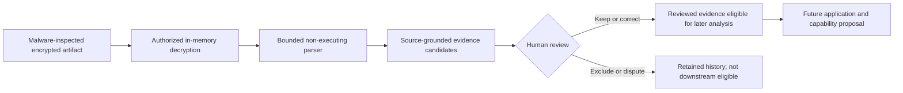

# PIA Protected Evidence Extraction Profile

> **Development state: IN PROGRESS — SUBJECT TO CHANGE.**
> This profile describes the first local, protected extraction and participant
> review increment. It is not a production approval or an automatic analysis
> system.

## Purpose

The protected evidence layer closes the gap between encrypted document
staging and later application or capability analysis.

It makes source material reviewable without collapsing three distinct acts:

1. extracting what a document says;
2. reviewing whether the extracted representation is faithful; and
3. interpreting what accepted evidence may support.

Only the first two occur in this increment.

## Flow



No plaintext staging file is created. Complete extracted text is immediately
encrypted as session-scoped content, and candidate/review records are written
to the encrypted session record.

## Responsibility boundary

The extraction component may:

- identify paragraph, page, and row boundaries;
- normalize whitespace;
- preserve section labels;
- propose one of the existing neutral evidence types;
- preserve an original candidate and source locator;
- route unsupported or unreadable material to review; and
- report that selectable text or an approved parser is absent.

It may not:

- infer a capability, identity, trait, aptitude, or proficiency;
- score evidence or confidence;
- resolve a credential definition;
- claim educational or professional application;
- execute macros, formulas, embedded objects, links, scripts, or archives;
- silently invoke OCR, a remote service, or a model;
- accept its own candidates for downstream use; or
- write to Neo4j.

## Security and privacy composition

The layer inherits the Phase 2B controls:

- localhost-only authenticated access;
- current-user protected store keys;
- per-session AES-256-GCM encryption;
- source malware inspection before storage;
- purpose and scope authorization;
- immediate withdrawal blocking;
- finite retention and owner-controlled deletion;
- encrypted append-only audit events; and
- store-wide integrity validation.

It adds:

- explicit `evidence_extraction` scope;
- parser-specific size and complexity limits;
- no temporary plaintext file;
- encrypted extracted-text storage;
- evidence-source identity and locator preservation;
- idempotency by source checksum and parser version;
- append-only candidate review events; and
- an enforced empty capability-assertion output.

## Protected session continuity

Browser authentication remains memory-only and is invalidated when the local
server restarts. The encrypted intake session is independently durable within
its authorized retention period.

After fresh authentication, the interface may show a bounded minimal index of
active sessions containing only the private session label, processing state,
scope, timestamps, and document/evidence/credential progress. The interface
must distinguish the current session, group sessions containing saved work
ahead of empty sessions, and render timestamps for participant readability.
Reopening a session is a deliberate audited event. Only then may the interface
restore staged-document references, current evidence-review state, and
protected credential-resolution results.

If an open session already uses the proposed private label, session creation
must pause and show the existing session index before accepting a separate
explicit creation decision. The label is a navigation aid rather than a unique
participant identifier, so this is an accidental-duplication guard rather than
an identity constraint.

Withdrawn, blocked, deleted, and retention-expired sessions are not resumable.
The session index does not expose document text, evidence text, detailed
review history, or credential content.

Deletion tombstones permanently retire their participant/session identifiers.
Allocation must consider both active session directories and tombstone names.
An active directory sharing a tombstoned identifier is a blocking integrity
finding and must not be listed or resumed. Lifecycle actions clear and refresh
the browser's cached active-session summaries, replace stale current-session
messaging, and name the exact removed session so deleted work is not presented
as current.

## Review experience

After staging a supported file, an authorized local user can choose
**Extract reviewable evidence**. Each source-grounded item then offers:

- **Keep this evidence**;
- **Correct wording**; or
- **Exclude**.

Dispute is present in the service contract and can be exposed in a later
participant-specific review surface. The current authenticated interface is
an operator/reviewer surface, so keeping an item records `reviewed`, not
`participant_confirmed`.

## Downstream gate

A later layer may select a candidate only when:

```text
review_status = reviewed
included_in_downstream = true
source_id resolves to the staged artifact
source_locator is present
```

That eligibility does not itself create an application assertion or evidence-
capability mapping. The future linking/mapping layer must retain its own
inference level, confidence basis, negative boundary, source-dependence, and
review status.

## Current limits

- PDF support is selectable text only and requires `pypdf`.
- Image uploads—including PNG, JPG/JPEG, HEIC, TIFF, screenshots, and
  image-only or scanned PDFs—are not supported. OCR is not implemented, and
  this limitation must be visible at document intake.
- General ZIP extraction is not implemented.
- Legacy `.doc` conversion is not implemented.
- Automatic credential-title discovery, batch normalization, duplicate
  grouping, and exception-only participant queues are not implemented. The
  current credential-entry screen is a manual fallback and test surface.
- Tables are represented conservatively rather than semantically reconstructed.
- The classifier uses bounded lexical and section-label rules for evidence
  type only.
- There is no remote processing, model-assisted interpretation, graph
  projection, or report generation.

## Planned durable image boundary

Images are an expected modern evidence source, not an exceptional format.
Durable support must therefore be designed as a first-class protected intake
path rather than added as an implicit file conversion.

The future path should preserve the encrypted original, inspect the image and
decoder, record integrity and format metadata, perform OCR only through an
approved local or explicitly authorized process, and store OCR text as a
separate encrypted derived artifact. OCR method and OCR confidence must remain
distinct from evidence confidence. Region-level provenance should be retained
where available, and participant or accountable review must precede
downstream eligibility. Withdrawal, deletion, and retention apply to both the
image and every derivative.

Until that boundary is implemented, the safe workaround is a locally prepared
TXT or DOCX transcription with the original retained separately. Participant
images must not be sent to an unapproved cloud OCR service.

## Governing contract

The implementation follows the
[PIA Protected Evidence Extraction Contract](../../docs/contracts/PIA_Protected_Evidence_Extraction_Contract_v0.1.md)
and its
[machine-readable projection](../../data/contracts/pia_protected_evidence_extraction_contract_v0.1.json).
