# OSI/PIA Graph Evidence Tour

**Classification:** Synthetic demonstration — no real participant data.

## 1. Basic PIA evidence chain

PIA preserves the inspectable path from participant-authorized source material
to evidence and bounded capability representation.

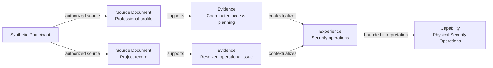

## 2. Evidence convergence

A capability can retain multiple supporting evidence paths without treating
frequency as proof of competence.

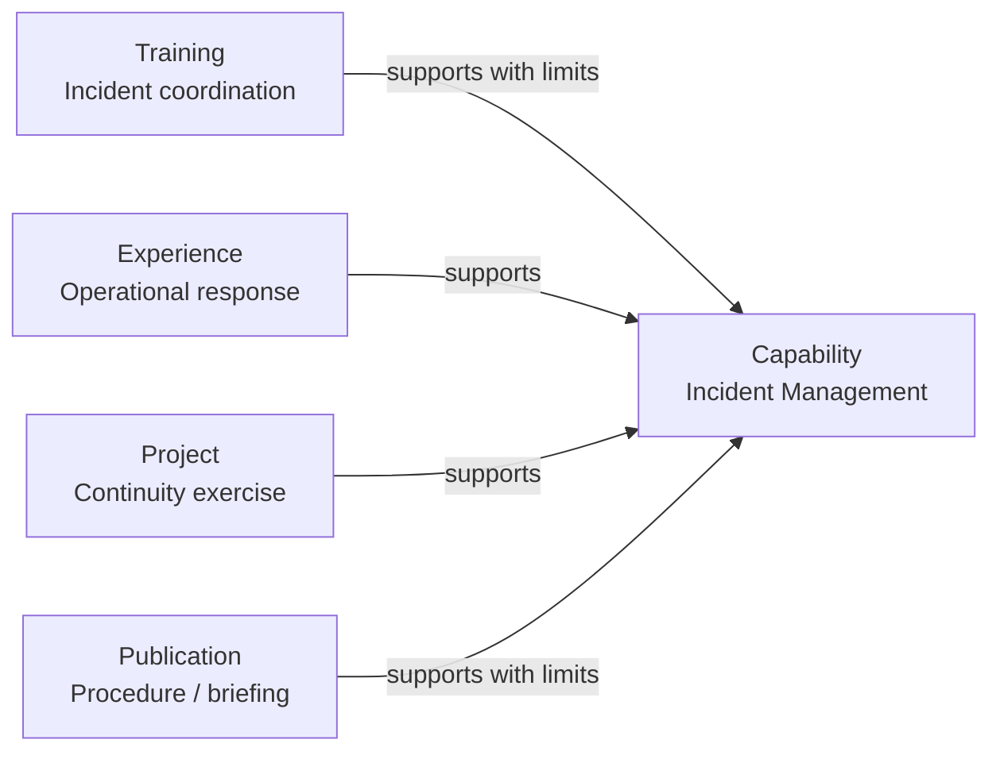

## 3. Capability blockage

OSI distinguishes capability absence from capability blockage.

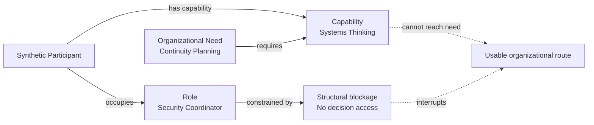

## 4. Bridge position and dependency bottleneck

A vacancy can change topology when one role carries unique relationships,
knowledge, or routing responsibility.

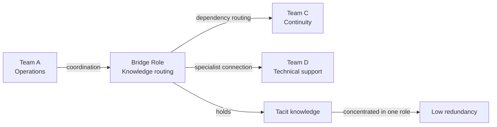

## 5. State transition

OSI examines what changes when a role or relationship changes state.

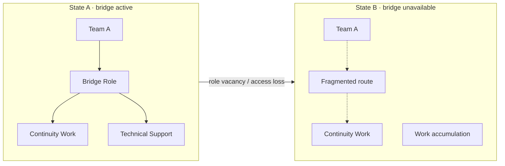

## 6. Trust and flow

Trust is represented as a bounded condition connected to observable cooperation
and capability utilization.

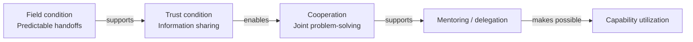

## 7. Evidence provenance

Interpretations remain traceable through assurance to their source material.

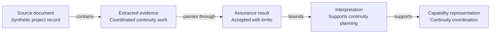

## 8. Congruence across ontologies

Participant and organizational concepts can relate without being collapsed.

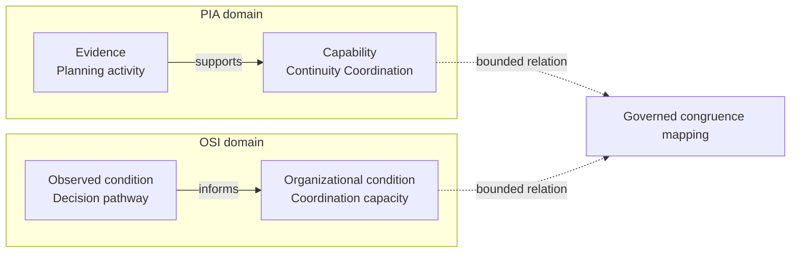

## 9. Assurance path

Graph objects are downstream of package validation and assurance.

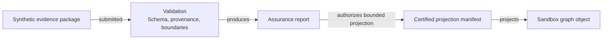

## 10. Knowledge lifecycle

The architecture can represent how knowledge is developed, tested, promoted,
and maintained.

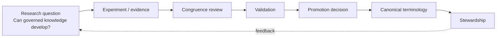

## 11. Governed cross-domain mapping

Individual and organizational knowledge can relate through explicit bounded
mappings while preserving domain boundaries.

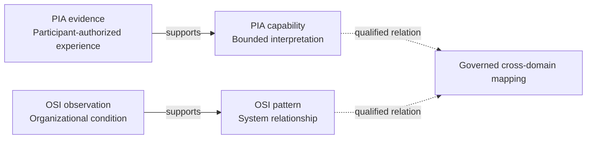
