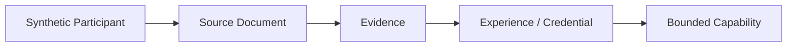
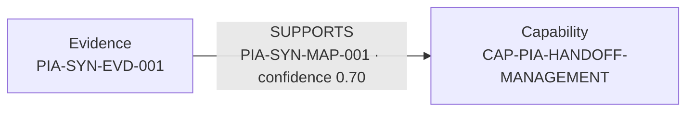
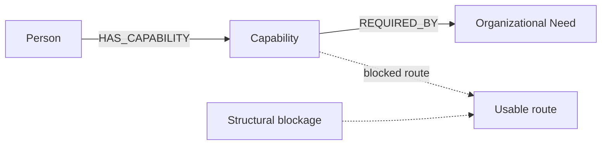
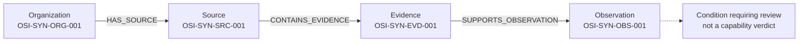
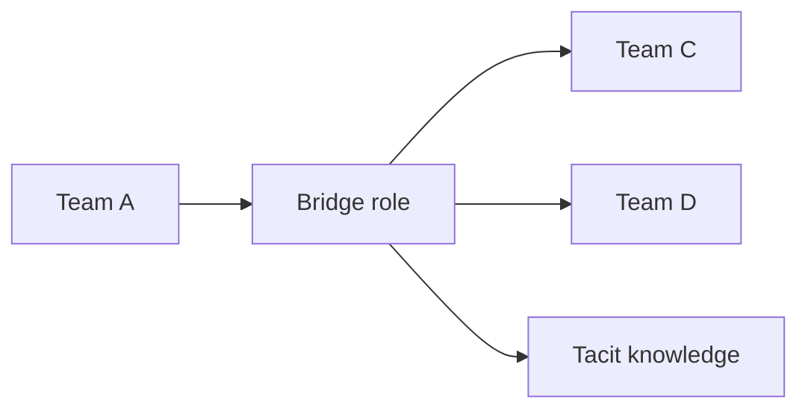
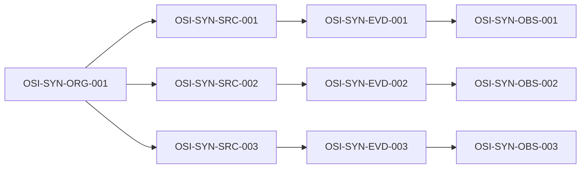
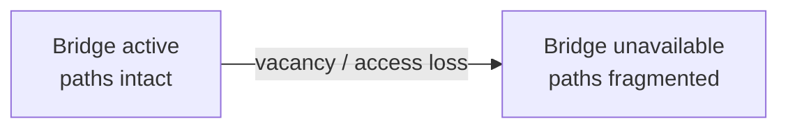
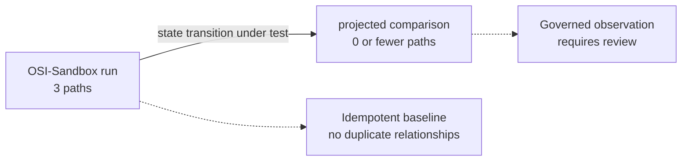
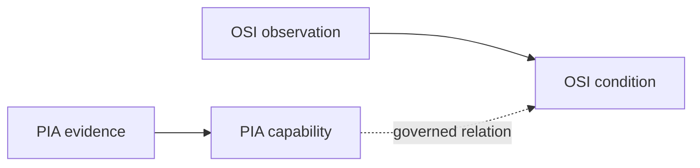
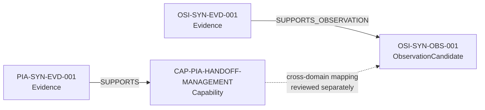

# Live Sandbox Graph Tour

**Classification:** Synthetic demonstration — no real participant data.

This tour pairs five conceptual diagrams with implementation views derived from
the validated PIA-Sandbox and OSI-Sandbox projections. The implementation views
use the exact synthetic labels and relationship vocabulary exercised by the
assurance scripts; they are deliberately small, reusable graph views rather
than database screenshots.

Each pair answers a bounded question:

1. Where did a PIA representation come from?
2. Why is existing capability not producing results?
3. Which structural relationship creates a dependency bottleneck?
4. What changed, and how did the effects propagate?
5. How can individual and organizational knowledge relate without collapsing
   their boundaries?

## 1. PIA evidence chain

### Conceptual model

### Implemented graph view

The validated sandbox projection proves the exact `Evidence -[SUPPORTS]->
Capability` assertion. Source provenance remains in the protected intake
record and is not exposed in this public-safe view.

### What this demonstrates

PIA can project a reviewed, bounded interpretation into a graph without
turning a résumé claim or opaque score into an unsupported fact.

## 2. Capability blockage

### Conceptual model

### Implemented graph view

The OSI sandbox uses `Organization → Source → Evidence → ObservationCandidate`
and the `SUPPORTS_OBSERVATION` relationship. It stores an observed condition;
it does not silently convert that condition into an individual deficiency.

### What this demonstrates

OSI can preserve organizational conditions as distinct observations so that
capability absence and capability blockage remain analytically separable.

## 3. Bridge/dependency bottleneck

### Conceptual model

### Implemented graph view

This is the three-path OSI synthetic structure validated for idempotence. The
shared organization anchor and separate source/evidence/observation paths are
the safe substrate for later dependency and vacancy analysis.

### What this demonstrates

Topology can be inspected as a set of traceable paths rather than as a score;
loss of a shared routing or knowledge relationship can therefore be tested as
a state change.

## 4. State transition

### Conceptual model

### Implemented graph view

The implementation view intentionally labels the transition as a test, not as
a claim already stored in the graph. The assurance result establishes a
repeatable baseline from which a vacancy/confound experiment can be compared.

### What this demonstrates

OSI is designed to compare graph states and propagation effects, not merely to
describe a static collection of nodes.

## 5. Governed cross-domain mapping

### Conceptual model

### Implemented graph view

The dotted edge is a conceptual handoff, not an assertion written by either
synthetic importer. PIA and OSI retain their own node types, identifiers,
assurance rules, and review boundaries.

### What this demonstrates

The architectures can relate individual capability evidence to organizational
conditions without collapsing the PIA and OSI ontologies into one undifferentiated
claim.

## Assurance and publication placement

This tour is indexed under both Evidence and Publication Assurance. It is:

- synthetic and participant-safe;
- editable Mermaid source;
- reusable for later rendering or live-query capture;
- bounded to validated sandbox labels and relationships; and
- reviewed before publication.

The corresponding assurance records are the PIA and OSI sandbox projection
milestones in `docs/history/`. A future live Neo4j capture may be added beside
these diagrams only when it can be reproduced without exposing credentials,
local paths, raw participant material, or connection details.
