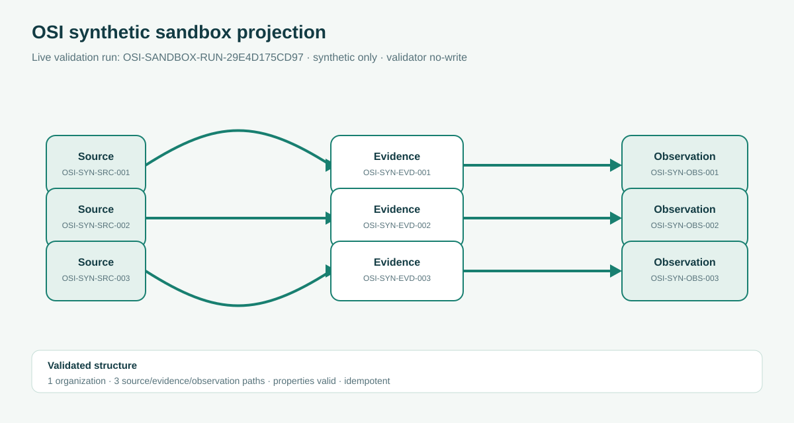
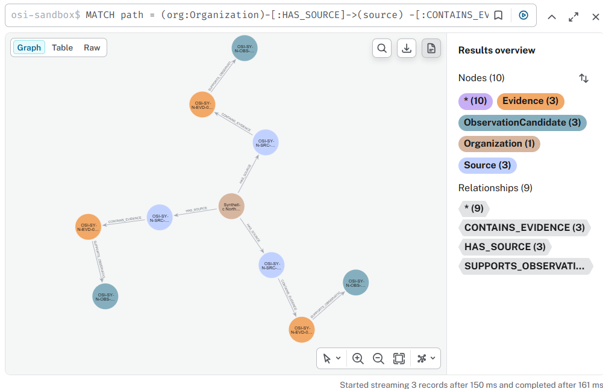
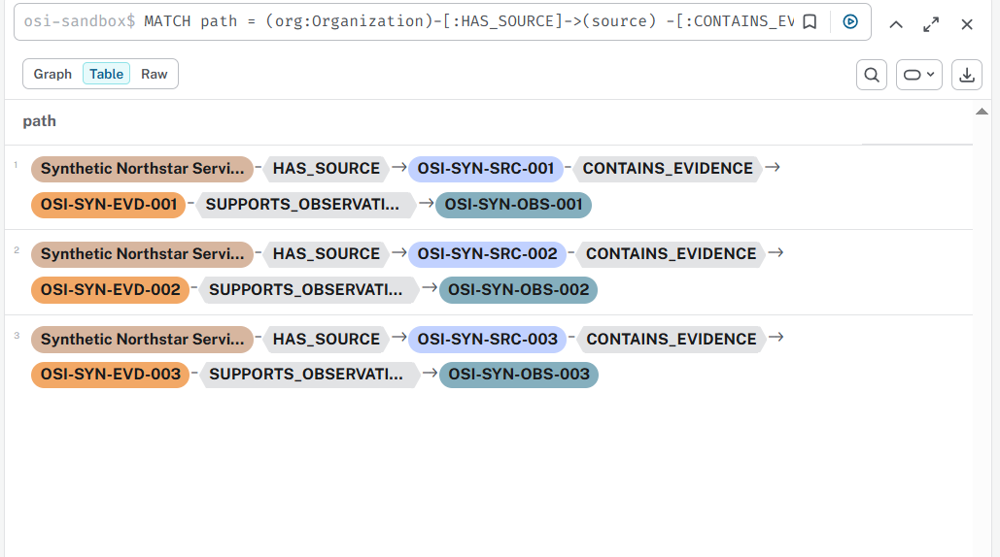

# OSI Live Synthetic Sandbox Validation

## Result

The validated synthetic organizational-evidence package was projected into the
local `osi-sandbox` database and checked read-only.

Run identifier: `OSI-SANDBOX-RUN-29E4D175CD97`

The run passed with three exact observation relationships and no write performed
by the validator.

| Check | Result |
| --- | ---: |
| Status | `pass` |
| Relationships | 3 |
| Organization nodes | 1 |
| Source nodes | 3 |
| Evidence nodes | 3 |
| Observation nodes | 3 |
| Expected paths | 3 |
| Properties valid | `true` |
| Audit run count | 1 |
| Idempotent structure | `true` |
| Validator graph write | `not_performed` |

## Bounded interpretation

This result demonstrates that the synthetic package can be written to the
local OSI sandbox and independently validated as a stable, source-grounded
organization → source → evidence → observation structure.

It does not establish organizational truth, diagnostic accuracy, prevalence,
causality, generalizability, or production readiness. The package is synthetic
and contains no participant material.

## Walkthrough image

The image is a public-safe walkthrough view reconstructed from the validated
run counts and identifiers. It is intentionally not a database screenshot and
does not expose credentials, local paths, or participant data.

### Live graph walkthrough

The graph view shows the organization branching into three synthetic
source-to-evidence-to-observation paths.

The table view shows the same three paths as inspectable records. Together the
images demonstrate topology and exact provenance for the validated run.

## Reproduction record

The import used the repository's synthetic fixture and the local Neo4j DBMS.
The read-only validator was then run with the returned run identifier. The
validator reported `graph_write: not_performed`, preserving the assurance
boundary between projection and inspection.
